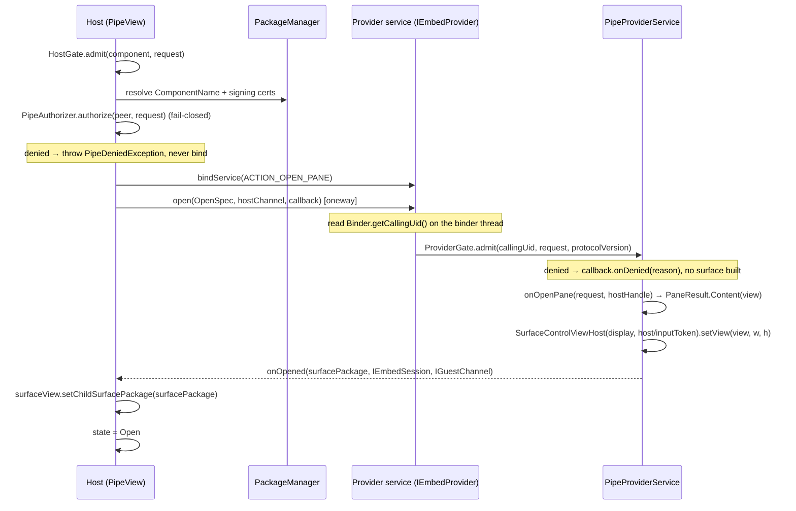
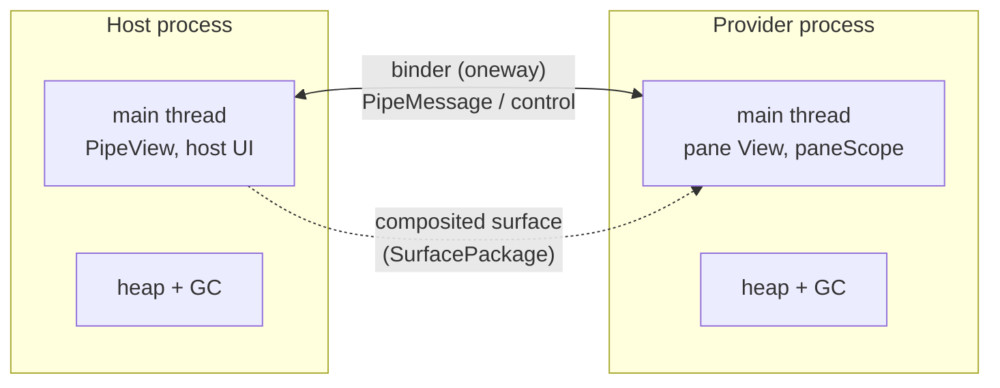

# Pipe — Architecture

Pipe lets one Android app render a **live, fully interactive UI inside another app's window**, across a process boundary, with a cryptographic identity check on both ends. A **host** app places a pane in its layout; a **provider** app renders a `View` into that pane in its *own* process, over the platform's `SurfaceControlViewHost` transport, with a two-way typed message channel between them.

This document explains how that works and why it is built the way it is. For task-level API usage, see [`README.md`](README.md).

---

## 1. The idea

Android keeps a hard line between apps: one app cannot draw into, read, or run code inside another. The usual ways to show "someone else's UI" — WebViews, screenshots, remote `RemoteViews` widgets — are either not really the other app's code, not interactive, or not isolated.

Pipe crosses that line **cooperatively and safely**: two apps that both opt in can compose their UIs, while staying two distinct processes with two distinct trust domains. Concretely you get:

- **Two independent UI threads.** The pane renders and handles input on the *provider's* main-thread Looper, on its own frame budget. Host jank never stalls the pane; pane jank never stalls the host.
- **Two separate heaps and garbage collectors.** The provider's allocations and GC pauses do not touch the host's UI thread, and its memory does not count against the host's per-process heap limit.
- **Crash and OOM isolation.** If the provider dies, the host survives and observes a clean `PEER_DIED` close.
- **A verified trust boundary.** Each side cryptographically checks the other's signing identity before any surface or message crosses. The provider's code never runs in the host's process.

The mechanism is "two processes cooperating"; the value is "a host safely running an untrusted provider's live UI on its own budget." It is *not* a way to get more CPU cores — a busy device still time-shares the same cores. The win is **isolation of parallelism** (separate main thread, heap, and failure domain) plus a **security boundary between two different apps**.

### What it is not

- Not a general parallel-compute framework — for that, use coroutines/threads within one process. Pipe's value is specifically isolated **UI** + a cross-app trust boundary.
- Not an overlay/tapjacking trick. Pipe uses only the platform's sanctioned cross-process UI APIs and deliberately avoids window-token or draw-over side channels.
- Not for an open marketplace of arbitrary providers. It targets a **closed app family / vetted partners** (same signing key, or an explicit certificate allowlist).

---

## 2. Vocabulary

| Term | Meaning |
|---|---|
| **Host** | The app that embeds a pane and controls its placement, size, lifetime, and revocation. |
| **Provider** | The app that renders the pane's `View`, in its own process, on request. |
| **Pane** | The embedded surface: the provider's `View` composited into the host's window via `SurfaceControlViewHost`. |
| **Session** | A live, opened pane. Represented host-side by `PipeSession`; ends on close or peer death. |
| **Presentation** | How the host shows the pane: `EMBEDDED`, `FULL_SCREEN`, or `DIALOG`. |
| **Peer identity** | The cryptographically verified UID + package(s) + signing-cert lineage of the other side. |

---

## 3. Module layout

```
:pipe                  The library. Host API, provider API, transport, identity, channels.
:pipe-serialization    Opt-in typed messaging: CBOR encode/decode over the raw PipeMessage envelope.
:sample-contract       Example @Serializable message contract shared by the two sample apps.
:sample-host           Demo host: embedded / full-screen / dialog / multi-pane, over a certification flow.
:sample-provider       Demo provider: a consent pane that signs a host nonce with an AndroidKeyStore key.
:evil-host             Adversarial host, signed with a different key — proves the provider gate rejects it.
:evil-provider         Adversarial provider — proves the host gate rejects it, with no surface or bind.
```

Only `:pipe` (and optionally `:pipe-serialization`) ship. The `evil-*` modules exist so the security properties are asserted by real instrumented tests, not just claimed.

`:pipe` binary compatibility is enforced by the binary-compatibility-validator (`:pipe:apiCheck`); every public API change regenerates `pipe/api/pipe.api`.

---

## 4. Package map (inside `:pipe`)

```
core/         Public value types crossing the boundary and surfaced to callers:
              Pipe (constants), PipeRequest, PipeMessage, PipeSize, PipePresentation,
              PipeState, CloseReason, PipeError, PipeException hierarchy.
auth/         Identity + authorization: PeerIdentity, SigningSource/AndroidSigningSource,
              IdentityResolver, PipeAuthorizer, PipeAuthorizers, AuthDecision.
host/         Host side: PipeView, PipeFullScreen, PipeDialog, PipeSession, ProviderComponent,
              HostGate.
provider/     Provider side: PipeProviderService, PipeContent, PaneResult, HostHandle, ProviderGate.
channel/      MessageSequencer (OutboundSequencer / InboundSequencer).
discovery/    PipeDiscovery, ProviderDescriptor.
transport/    AIDL wire: IEmbedProvider, IOpenResultCallback, IEmbedSession, IHostChannel,
              IGuestChannel, OpenSpec; Protocol (version).
```

---

## 5. The transport (wire protocol)

The boundary is a small set of `oneway` AIDL interfaces. `oneway` means non-blocking, in-order delivery to a single remote — the app code never blocks a binder thread, and ordering is a property we lean on (the sequencers below are a safety net, not the primary ordering mechanism).

```aidl
// Provider's bound service. Host → provider.
interface IEmbedProvider {
    int protocolVersion();
    oneway void open(in OpenSpec spec, IHostChannel hostChannel, IOpenResultCallback callback);
}

// Result of open(), delivered by the provider. Provider → host.
oneway interface IOpenResultCallback {
    void onOpened(in SurfacePackage surfacePackage, IEmbedSession session, IGuestChannel guestChannel);
    void onDenied(String reason);
    void onError(String message);
}

// Host's handle to control a live pane. Host → provider.
interface IEmbedSession { oneway void resize(int w, int h); oneway void close(); }

// Provider → host messages + close signal. Provider holds this (given in open()).
interface IHostChannel { oneway void send(in PipeMessage m); oneway void onClosed(int closeReasonWire); }

// Host → provider messages. Host holds this (returned in onOpened()).
interface IGuestChannel { oneway void send(in PipeMessage m); }
```

`OpenSpec` is the launch payload the host hands the provider:

```
OpenSpec(
    hostToken: IBinder?,       // host input token for API 30–34 (SurfaceView.getHostToken)
    inputToken: Parcelable?,   // API-35 InputTransferToken, carried as Parcelable so pre-35 can load OpenSpec
    displayId: Int,
    widthPx, heightPx: Int,
    request: PipeRequest,      // action + extras + presentation
    protocolVersion: Int,
)
```

### The open handshake



Key points:

- **Identity is read at the earliest correct moment.** `Binder.getCallingUid()` only reflects the caller *inside* the transaction, so the provider captures it on the binder thread before any coroutine hop.
- **Gating happens on both ends, before anything expensive.** The host authorizes the provider before it binds; the provider authorizes the host before it builds a surface. A denial on either side produces no surface and (host side) no bind.
- **The surface travels as a `SurfacePackage`.** The provider builds a `SurfaceControlViewHost` against the host's input token (an API-35 `InputTransferToken`, or a pre-35 `IBinder` host token — see §9) and display, then ships the wrapped surface back; the host attaches it with `SurfaceView.setChildSurfacePackage`.

---

## 6. Process & threading model



- The provider's pane construction, message handling, and provider-initiated sends run on the provider's **main thread** via a service-owned `paneScope` (`Dispatchers.Main.immediate` + `SupervisorJob`). The provider is responsible for pushing its own heavy work onto background threads — Pipe gives it a *separate* main thread, not extra ones.
- Cross-process identity resolution (PackageManager cert lookups) runs on `Dispatchers.IO` host-side so it never blocks the caller's main thread.
- Everything on the wire is `oneway`, so neither side ever blocks a binder thread waiting on the other.

---

## 7. Identity & trust

The single most important property: **no identity on the wire is self-reported.** A peer's identity is always built by the library from an OS-provided fact, never from a field the other app filled in.

- **Provider side** derives the host's identity from `Binder.getCallingUid()` (kernel-attested), then resolves packages + signing certificates for that UID.
- **Host side** derives the provider's identity from the resolved `ComponentName` it is about to bind, via `PackageManager` signing info.

`PeerIdentity` carries the verified `uid`, `packages`, and `signingCertSha256` (lowercase hex, full rotation lineage). Authorization is a pure function of that identity:

```kotlin
fun interface PipeAuthorizer {
    suspend fun authorize(peer: PeerIdentity, request: PipeRequest): AuthDecision  // Allow | Deny(reason)
}
```

Built-ins (`PipeAuthorizers`):

- `sameSigningKey(context)` — allow only peers signed with the caller's own key (the default; the closed-family case).
- `allowlist(vararg certSha256)` — allow specific signing certificates.
- `anyOf(...)` — compose authorizers.

Because `authorize` is `suspend`, a policy may consult a remote service, a database, or an attestation check before deciding — all without blocking.

### Two gates

- `HostGate.admit(component, request)` (host) resolves the provider's identity, runs the authorizer, and returns `Admitted(peer)` / `Refused(reason)` / `Failed(message)`. Only `Admitted` proceeds to bind.
- `ProviderGate.admit(callingUid, request, protocolVersion)` (provider) does the same for the host, plus a protocol-version check, before any surface is built.

### UID-gated callbacks (defense in depth)

After a session is live, **every** inbound binder call is re-checked against the UID admitted at open time, on both sides:

- The provider's `IEmbedSession.resize/close` and `IGuestChannel.send` drop any call whose `Binder.getCallingUid()` does not match the admitted host UID.
- The host applies the same check to inbound `send` / `onClosed`.

So even a leaked binder handle cannot drive a session from a different UID. Peer death is handled by `linkToDeath` on both sides, producing a `PEER_DIED` close.

### Adversarial tests

`:evil-host` (different signing key) and `:evil-provider` are real installable apps used by instrumented tests to prove both directions of rejection: an evil provider is denied by the host with **no bind and no surface**; an evil host is denied by the provider with **no surface built**. A suspending authorizer that yields and then denies is also exercised, to prove the async path fails closed.

---

## 8. Session, channels, and messages

Host-side, a live pane is a `PipeSession`:

```kotlin
interface PipeSession {
    val peer: PeerIdentity
    val state: StateFlow<PipeState>       // Connecting | Open(peer) | Closed(cause?)
    val messages: Flow<PipeMessage>       // provider → host
    suspend fun send(message: PipeMessage): Boolean   // host → provider
    suspend fun resize(size: PipeSize)
    fun close()
}
```

Provider-side, the symmetric handle is `HostHandle` (`peer` + `suspend send`), and the pane itself is a `PipeContent` (`view` + `onMessage` / `onResized` / `onClosed` callbacks). `PipeProviderService.onOpenPane(request, host): PaneResult` returns either `PaneResult.Content(content)` or `PaneResult.Reject(reason)`.

### Channel guarantees

Each direction has an independent `OutboundSequencer` (stamps a monotonically increasing `seq`) and the receiver an `InboundSequencer`:

- **Ordered** — messages are delivered in send order (oneway binder + the sequencer as backstop).
- **De-duplicated** — a message whose `seq` regresses or repeats is dropped.
- **Gap-tolerant** — the sender may skip sequence numbers; the receiver accepts forward jumps. The channel is *not* "gap-free" — it is at-most-once, in order.

`PipeMessage` is a `Bundle` envelope with an internal `seq`. The raw API is untyped by design.

### Typed messaging (`:pipe-serialization`)

Opt-in typed messages layer on top without changing the transport. `PipeCodec` CBOR-encodes a `@Serializable` payload into the `PipeMessage` envelope, tagged with the type's qualified name; the receiver decodes only matching types. Extensions make it ergonomic:

```kotlin
suspend inline fun <reified T> PipeSession.send(payload: T): Boolean
inline fun <reified T> PipeSession.messagesOf(): Flow<T>
suspend inline fun <reified T> HostHandle.send(payload: T): Boolean
```

Sealed hierarchies must be sent as the **supertype** (the codec matches on the exact qualified name), so a shared contract module typically exposes a sealed message type.

---

## 9. Presentation modes

The provider's `PaneResult.Content` is identical across modes; only the **host container** and the surface size differ. The chosen mode travels in `PipeRequest.presentation`, so a provider *may* adapt its layout, but the host decides.

| Mode | Host type | Container |
|---|---|---|
| `EMBEDDED` | `PipeView` | a `View` in the host's layout |
| `FULL_SCREEN` | `PipeFullScreen.open(...)` | a full-bleed, inset-padded container added to `android.R.id.content` |
| `DIALOG` | `PipeDialog.show(...)` | a dimmed scrim + centered card overlay in the host's content view |

Full-screen and dialog wrap the same `PipeView` and reuse the same `open()` / `PipeSession` core; they add only host-owned chrome and lifecycle. (`DIALOG` is an in-activity overlay rather than a real `android.app.Dialog`: a second window breaks embedded-`SurfaceControlViewHost` input focus and hides the pane from the accessibility tree. Keeping the pane at the same window-nesting depth as full-screen avoids both.)

### Cross-process input

A plain `SurfaceView` does **not** forward touches into an embedded `SurfaceControlViewHost`; the host must link its input token to the embedded window. Pipe does this two ways, selected by API level, and the choice is baked into `OpenSpec` (which token field is non-null):

- **API 35+** — the host passes a public `android.window.InputTransferToken` (`OpenSpec.inputToken`); the provider builds `SurfaceControlViewHost(ctx, display, InputTransferToken)`. Touch is handed across per `ACTION_DOWN` with `WindowManager.transferTouchGesture()` in embedded mode, or — where the pane is the whole surface (full-screen/dialog) — by rendering the surface on top (`setZOrderOnTop(true)`) so it receives input directly.
- **API 30–34** — there is no public input-token accessor and no `transferTouchGesture`, so the host obtains its input token via the `@hide` `SurfaceView.getHostToken()` (reached by reflection), passes it as an `IBinder` (`OpenSpec.hostToken`), and the provider builds the older `SurfaceControlViewHost(ctx, display, IBinder)` constructor (API 30). The pane surface is z-ordered on top, and with the host-token link the embedded window receives touch directly — no `transferTouchGesture` needed.

`SurfaceControlViewHost` itself is API 30, which is the library's hard floor; below it there is no cross-process embedding at all (the host degrades to a clean `PipeTransportException`, not a crash).

**Caveats of the pre-35 path:** `getHostToken()` is a non-SDK method — greylisted (works on stock 30–34), but potentially restricted on some OEM builds or a future OS; if it is blocked, Pipe falls back to the window token and input may not route. Cross-process **IME** is also weaker before 35. On API 35, prefer the public path.

**Embedded-mode note (API 35):** the per-gesture `transferTouchGesture` on API 35 can fail to deliver a *second* gesture in some sequences (e.g. after an intervening host-side tap), so the sample treats an embedded API-35 session as effectively single-interaction and reopens for the next. Full-screen/dialog (direct z-order input) and the API-30–34 host-token path are not affected.

---

## 10. Lifecycle & teardown

A session moves `Connecting → Open → Closed`. `PipeState.Closed(cause)` carries a `null` cause for a clean close and a `PipeException` for a failure. `CloseReason` on the wire is `HOST_CLOSED`, `PROVIDER_CLOSED`, or `PEER_DIED`.

Teardown is **idempotent** and converges from every trigger — host `close()`, provider `Reject`/close, back-press, activity destroy, open timeout, or peer death (`linkToDeath`). The container presentations (`PipeFullScreen`, `PipeDialog`) additionally observe `session.state` and tear their chrome down when the session closes by *any* path, then complete that observer so it does not retain the detached view tree.

Errors surface as a small `PipeException` hierarchy (`PipeDeniedException`, `PipeTimeoutException`, `PipeTransportException`, …); `PipeError.Code` enumerates `PROVIDER_NOT_FOUND`, `CERT_UNREADABLE`, `VERSION_MISMATCH`, `TIMEOUT`, `TRANSPORT_FAILURE`.

---

## 11. Discovery

`PipeDiscovery.query(context, action)` resolves installed providers for a pane action via `PackageManager` and enriches each with its signing certificate, returning `ProviderDescriptor(component, packageName, label, certSha256)`. A host can then apply the same authorization policy to choose which provider to open. Discovery is optional — a host that already knows its provider's `ProviderComponent` skips it.

---

## 12. Security model summary

**Defends against:**

- A malicious app impersonating a trusted provider or host — identity is kernel/PackageManager-derived, never self-reported, and checked on both ends before any surface or message crosses.
- A rogue peer driving a session it was not admitted to — every inbound call is UID-gated after open.
- Provider code executing in the host (or vice versa) — it never does; only a composited surface and typed messages cross.
- Silent overlay/tapjacking — Pipe uses only sanctioned cross-process UI APIs and no window-token/draw-over side channel; the host controls placement, size, and revocation.

**Explicitly out of scope:**

- Open, unvetted provider ecosystems. The trust anchor is signing identity (same key or an allowlist); there is no runtime sandbox around arbitrary provider code beyond process isolation.
- Protecting a provider from a host that legitimately embeds it (the host owns the window it draws into).
- Devices below API 30 — `SurfaceControlViewHost` does not exist, so there is no cross-process embedding to secure; open fails with a `PipeTransportException`.

---

## 13. Known limitations & non-goals

- **`minSdk = 30` (Android 11) — the hard floor.** `SurfaceControlViewHost`, the embedding primitive, is API 30; nothing works below it. API 30–34 run the host-token input path (§9), which relies on the reflected `@hide` `SurfaceView.getHostToken()` — greylisted today but non-SDK, and with weaker IME. API 35+ use the public `InputTransferToken` / `transferTouchGesture` path and get hardware attestation on real devices. Verified working end-to-end on API 30 (emulator) and API 36 (Pixel).
- **Embedded single-gesture-per-session** (§9) — the primary interactive limitation.
- **IPC granularity** — every message is a binder transaction; Pipe suits coarse-grained handoffs, not high-frequency small-message loops.
- **Per-process cost** — a second process carries a fixed memory/startup tax; "extra heap" is not free, and cold open has real latency (bind + handshake + surface attach).
- **Not theme-adaptive out of the box** — sample provider panes paint an explicit background; a real provider owns its own theming.
- **Maturity** — a coherent, adversarially-tested alpha, not yet a hardened production release.

---

## 14. Where to look in the code

| To understand… | Start at |
|---|---|
| Host open flow, input transfer, teardown | `host/PipeView.kt` |
| Full-screen / dialog containers | `host/PipeFullScreen.kt`, `host/PipeDialog.kt` |
| Provider service, surface build, UID-gated callbacks | `provider/PipeProviderService.kt` |
| Authorization policy | `auth/PipeAuthorizers.kt`, `auth/PipeAuthorizer.kt` |
| Identity resolution | `auth/AndroidSigningSource.kt`, `auth/IdentityResolver.kt` |
| Wire protocol | `transport/*.aidl`, `transport/OpenSpec.kt` |
| Channel ordering/dedup | `channel/MessageSequencer.kt` |
| Typed messaging | `pipe-serialization/…/PipeCodec.kt` |
| End-to-end behavior (incl. adversarial) | `sample-host/src/androidTest/…`, `evil-host/src/androidTest/…` |
