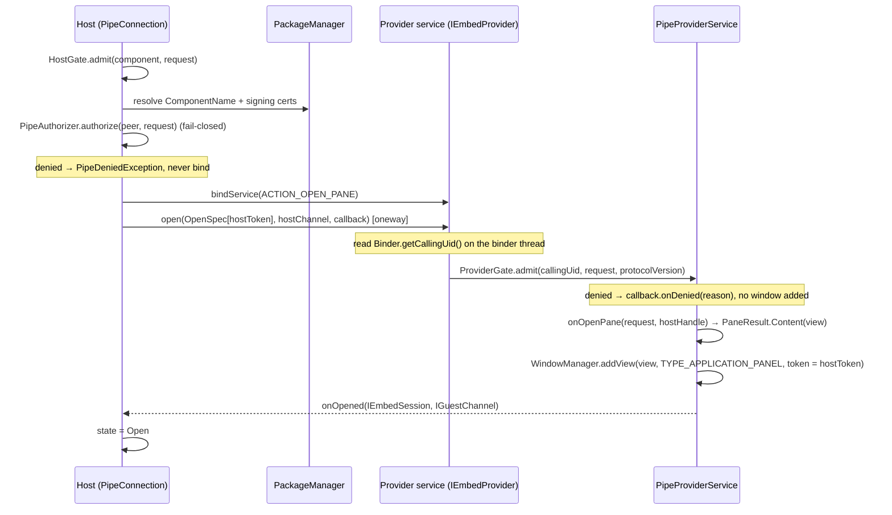
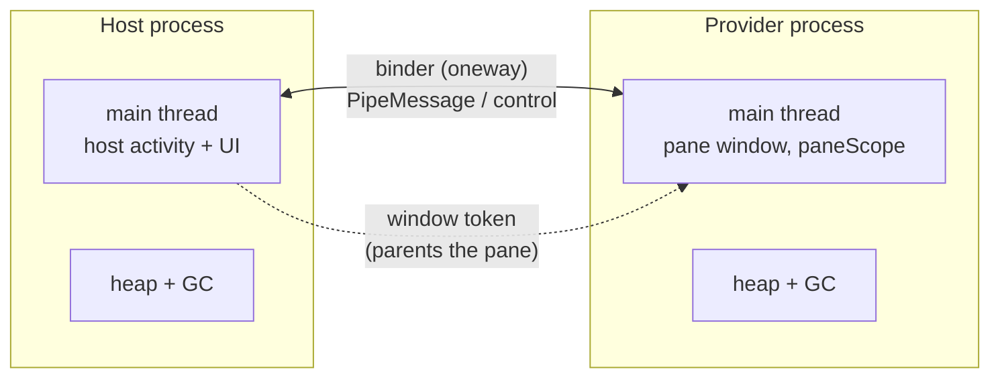

# Pipe — Architecture

Pipe lets one Android app render a **live, fully interactive full-screen UI over another app's window**, across a process boundary, with a cryptographic identity check on both ends. A **host** activity hands its window token to a **provider** app; the provider renders a `View` as a real full-screen window in the host's window hierarchy, in its *own* process, with a two-way typed message channel between them.

This document explains how that works and why it is built the way it is. For task-level API usage, see [`README.md`](README.md).

---

## 1. The idea

Android keeps a hard line between apps: one app cannot draw into, read, or run code inside another. The usual ways to show "someone else's UI" — WebViews, screenshots, remote `RemoteViews` widgets — are either not really the other app's code, not interactive, or not isolated.

Pipe crosses that line **cooperatively and safely**: two apps that both opt in can compose their UIs, while staying two distinct processes with two distinct trust domains. Concretely you get:

- **Two independent UI threads.** The pane renders and handles input on the *provider's* main-thread Looper, on its own frame budget. Host jank never stalls the pane; pane jank never stalls the host.
- **Two separate heaps and garbage collectors.** The provider's allocations and GC pauses do not touch the host's UI thread, and its memory does not count against the host's per-process heap limit.
- **Crash and OOM isolation.** If the provider dies, the host survives and observes a clean `PEER_DIED` close.
- **A verified trust boundary.** Each side cryptographically checks the other's signing identity before any window is added or message crosses. The provider's code never runs in the host's process.

The mechanism is "two processes cooperating"; the value is "a host safely running an untrusted-but-verified provider's live UI on its own budget." It is *not* a way to get more CPU cores — a busy device still time-shares the same cores. The win is **isolation of parallelism** (separate main thread, heap, and failure domain) plus a **security boundary between two different apps**.

### What it is not

- Not a general parallel-compute framework — for that, use coroutines/threads within one process. Pipe's value is specifically isolated **UI** + a cross-app trust boundary.
- Not a silent overlay / tapjacking trick. The provider *does* add a window over the host — but only after the host has cryptographically verified the provider's signing identity and explicitly handed over its window token. Both apps opt in; the host owns the binding and can revoke it. See §12.
- Not for an open marketplace of arbitrary providers. It targets a **closed app family / vetted partners** (same signing key, or an explicit certificate allowlist).

### One capability, on purpose

Pipe does exactly one thing: a provider draws a **single full-screen pane** over the host. An earlier design embedded a resizable, multi-instance pane inside the host's layout via `SurfaceControlViewHost`. That was deliberately cut: SCVH's cross-process input was only a first-class focus/IME target from API 35 up, and the pre-35 fallbacks leaned on touch-forwarding that never gave real soft-keyboard input. The full-screen sub-window is a *real* window, so focus, input, and IME work identically on every supported API with only public APIs — a smaller surface that behaves the same everywhere beats a larger one that behaves differently per version.

---

## 2. Vocabulary

| Term | Meaning |
|---|---|
| **Host** | The app that opens a pane and controls its lifetime and revocation. It supplies its window token; it does not place anything in its own layout. |
| **Provider** | The app that renders the pane's `View` as a full-screen window, in its own process, on request. |
| **Pane** | The provider's `View`, shown as a `TYPE_APPLICATION_PANEL` window parented to the host activity's window token. |
| **Session** | A live, opened pane. Represented host-side by `PipeSession`; ends on close or peer death. |
| **Peer identity** | The cryptographically verified UID + package(s) + signing-cert lineage of the other side. |

---

## 3. Module layout

```
:pipe                  The library. Host API, provider API, transport, identity, channels.
:pipe-serialization    Opt-in typed messaging: CBOR encode/decode over the raw PipeMessage envelope.
:sample-contract       Example @Serializable message contract shared by the two sample apps.
:sample-host           Demo host: a Compose screen that opens the provider's full-screen certification pane.
:sample-provider       Demo provider: a consent pane that signs a host nonce with an AndroidKeyStore key.
:sample-solo           One app, two processes — an Activity opens a pane against its own `:pane`-process service.
:evil-host             Adversarial host, signed with a different key — proves the provider gate rejects it.
:evil-provider         Adversarial provider — proves the host gate rejects it, with no window or bind.
```

Only `:pipe` (and optionally `:pipe-serialization`) ship. The `evil-*` modules exist so the security properties are asserted by real instrumented tests, not just claimed.

`:pipe` binary compatibility is enforced by the binary-compatibility-validator (`:pipe:apiCheck`); every public API change regenerates `pipe/api/pipe.api`.

---

## 4. Package map (inside `:pipe`)

```
core/         Public value types crossing the boundary and surfaced to callers:
              Pipe (constants), PipeRequest, PipeMessage,
              PipeState, CloseReason, PipeError, PipeException hierarchy.
auth/         Identity + authorization: PeerIdentity, SigningSource/AndroidSigningSource,
              IdentityResolver, PipeAuthorizer, PipeAuthorizers, AuthDecision.
host/         Host side: PipeFullScreen (public entry), PipeConnection (bind/gate/channel
              machinery), PipeSession, ProviderComponent, HostGate.
provider/     Provider side: PipeProviderService, PipeContent, PaneResult, HostHandle, ProviderGate.
channel/      MessageSequencer (OutboundSequencer / InboundSequencer).
discovery/    PipeDiscovery, ProviderDescriptor.
transport/    AIDL wire: IEmbedProvider, IOpenResultCallback, IEmbedSession, IHostChannel,
              IGuestChannel, OpenSpec; Protocol (version).
```

---

## 5. The transport (wire protocol)

The boundary is a small set of `oneway` AIDL interfaces. `oneway` means non-blocking, in-order delivery to a single remote — the app code never blocks a binder thread, and ordering is a property we lean on (the sequencers below are a safety net, not the primary ordering mechanism).

```aidl
// Provider's bound service. Host → provider.
interface IEmbedProvider {
    int protocolVersion();
    oneway void open(in OpenSpec spec, IHostChannel hostChannel, IOpenResultCallback callback);
}

// Result of open(), delivered by the provider. Provider → host.
oneway interface IOpenResultCallback {
    void onOpened(IEmbedSession session, IGuestChannel guestChannel);
    void onDenied(String reason);
    void onError(String message);
}

// Host's handle to control a live pane. Host → provider.
interface IEmbedSession { oneway void close(); }

// Provider → host messages + close signal. Provider holds this (given in open()).
interface IHostChannel { oneway void send(in PipeMessage m); oneway void onClosed(int closeReasonWire); }

// Host → provider messages. Host holds this (returned in onOpened()).
interface IGuestChannel { oneway void send(in PipeMessage m); }
```

`OpenSpec` is the launch payload the host hands the provider — just the host's window token plus the request:

```
OpenSpec(
    hostToken: IBinder,     // host activity's window token (decorView.getWindowToken())
    request: PipeRequest,   // action + extras
    protocolVersion: Int,
)
```

There is no surface, size, display, or input token on the wire: the provider adds its own full-screen window, so the host has nothing to render and nothing to size.

### The open handshake



Key points:

- **Identity is read at the earliest correct moment.** `Binder.getCallingUid()` only reflects the caller *inside* the transaction, so the provider captures it on the binder thread before any coroutine hop.
- **Gating happens on both ends, before anything expensive.** The host authorizes the provider before it binds; the provider authorizes the host before it adds any window. A denial on either side adds no window and (host side) does not bind.
- **The pane is a window the provider owns.** The provider adds a `TYPE_APPLICATION_PANEL` window parented to the host's window token (§9); nothing is shipped back for the host to render — `onOpened` carries only the control-session and guest channel binders.

---

## 6. Process & threading model



- The provider's pane construction, message handling, and provider-initiated sends run on the provider's **main thread** via a service-owned `paneScope` (`Dispatchers.Main.immediate` + `SupervisorJob`). The provider is responsible for pushing its own heavy work onto background threads — Pipe gives it a *separate* main thread, not extra ones.
- Cross-process identity resolution (PackageManager cert lookups) runs on `Dispatchers.IO` host-side so it never blocks the caller's main thread.
- Everything on the wire is `oneway`, so neither side ever blocks a binder thread waiting on the other.

### Host and provider in one app

Nothing in the model requires host and provider to be *different apps*. Give the provider `Service` its own process (`android:process=":pane"` in the manifest) and point the host at its own component (`ProviderComponent(packageName, "$packageName.PaneService")`), and you get the same thing **within a single app**: the pane runs in a second process — its own heap, main-thread Looper, and crash domain — rendered in the host's window. Because both processes share the app's UID, the window-token handoff and binder channel work if anything more freely than cross-app (no cross-UID window checks), and the `sameSigningKey` gate is trivially satisfied. This is *in-app process isolation for UI* — the pattern for running a heavy or risky component (WebView, SDK, ML/native view, plugin) off your main process. The provider service can be `exported="false"`, since it's bound by explicit component from inside the app. See `:sample-solo` (verified on device: host pid ≠ pane pid, same UID, one window).

Nor is a host limited to a single provider. Each `PipeFullScreen.open` adds an independent child window to the host's window token, so a host can open several panes — from several processes — at once; with transparent panes they composite into one surface. By default panes are full-screen and touch-modal, so only the top-most takes input — but sizing each pane to a region (`PaneSpec.gravity`/`heightPx`) and setting `PaneSpec.touchModal = false` (`FLAG_NOT_TOUCH_MODAL`, so touches outside a pane's bounds fall through) makes them **tile**: each pane is independently interactive, each on its own process's UI thread. `:sample-solo`'s "Open 3 panes" does exactly this — host + three `:pane*` processes = four processes, three interactive bands in one host window, each with a distinct kernel thread id. N processes rendering into one window is unrestricted.

---

## 7. Identity & trust

The single most important property: **no identity on the wire is self-reported.** A peer's identity is always built by the library from an OS-provided fact, never from a field the other app filled in.

- **Provider side** derives the host's identity from `Binder.getCallingUid()` (kernel-attested), then resolves packages + signing certificates for that UID.
- **Host side** derives the provider's identity from the resolved `ComponentName` it is about to bind, via `PackageManager` signing info.

`PeerIdentity` carries the verified `uid`, `packages`, and `signingCertSha256` (lowercase hex, full rotation lineage). Authorization is a pure function of that identity:

```kotlin
fun interface PipeAuthorizer {
    suspend fun authorize(peer: PeerIdentity, request: PipeRequest): AuthDecision  // Allow | Deny(reason)
}
```

Built-ins (`PipeAuthorizers`):

- `sameSigningKey(context)` — allow only peers signed with the caller's own key (the default; the closed-family case).
- `allowlist(vararg certSha256)` — allow specific signing certificates.
- `anyOf(...)` — compose authorizers.

Because `authorize` is `suspend`, a policy may consult a remote service, a database, or an attestation check before deciding — all without blocking.

### Two gates

- `HostGate.admit(component, request)` (host) resolves the provider's identity, runs the authorizer, and returns `Admitted(peer)` / `Refused(reason)` / `Failed(message)`. Only `Admitted` proceeds to bind and hand over the window token.
- `ProviderGate.admit(callingUid, request, protocolVersion)` (provider) does the same for the host, plus a protocol-version check, before any window is added.

### UID-gated callbacks (defense in depth)

After a session is live, **every** inbound binder call is re-checked against the UID admitted at open time, on both sides:

- The provider's `IEmbedSession.close` and `IGuestChannel.send` drop any call whose `Binder.getCallingUid()` does not match the admitted host UID.
- The host applies the same check to inbound `send` / `onClosed`.

So even a leaked binder handle cannot drive a session from a different UID. Peer death is handled by `linkToDeath` on both sides, producing a `PEER_DIED` close.

### Adversarial tests

`:evil-host` (different signing key) and `:evil-provider` are real installable apps used by instrumented tests to prove both directions of rejection: an evil provider is denied by the host with **no bind and no window**; an evil host is denied by the provider with **no window added**. A suspending authorizer that yields and then denies is also exercised, to prove the async path fails closed.

---

## 8. Session, channels, and messages

Host-side, a live pane is a `PipeSession`:

```kotlin
interface PipeSession {
    val peer: PeerIdentity
    val state: StateFlow<PipeState>       // Connecting | Open(peer) | Closed(cause?)
    val messages: Flow<PipeMessage>       // provider → host
    suspend fun send(message: PipeMessage): Boolean   // host → provider
    fun close()
}
```

Provider-side, the symmetric handle is `HostHandle` (`peer` + `suspend send` + `close`, where `close` dismisses the provider's own pane), and the pane itself is a `PipeContent` (`view` + `onMessage` / `onClosed` callbacks). `PipeProviderService.onOpenPane(request, host): PaneResult` returns either `PaneResult.Content(content)` or `PaneResult.Reject(reason)`.

### Channel guarantees

Each direction has an independent `OutboundSequencer` (stamps a monotonically increasing `seq`) and the receiver an `InboundSequencer`:

- **Ordered** — messages are delivered in send order (oneway binder + the sequencer as backstop).
- **De-duplicated** — a message whose `seq` regresses or repeats is dropped.
- **Gap-tolerant** — the sender may skip sequence numbers; the receiver accepts forward jumps. The channel is *not* "gap-free" — it is at-most-once, in order.

`PipeMessage` is a `Bundle` envelope with an internal `seq`. The raw API is untyped by design.

### Typed messaging (`:pipe-serialization`)

Opt-in typed messages layer on top without changing the transport. `PipeCodec` CBOR-encodes a `@Serializable` payload into the `PipeMessage` envelope, tagged with the type's qualified name; the receiver decodes only matching types. Extensions make it ergonomic:

```kotlin
suspend inline fun <reified T> PipeSession.send(payload: T): Boolean
inline fun <reified T> PipeSession.messagesOf(): Flow<T>
suspend inline fun <reified T> HostHandle.send(payload: T): Boolean
```

Sealed hierarchies must be sent as the **supertype** (the codec matches on the exact qualified name), so a shared contract module typically exposes a sealed message type.

---

## 9. The pane window

The pane is a **real window**, not an embedded surface. On the admitted open, the provider:

1. Wraps the provider's `PipeContent.view` in a `PaneRoot` (a `FrameLayout` that pads itself by the system-bar insets so content never draws under the status/navigation bars, and turns a BACK key press into a provider-side dismissal).
2. Builds `WindowManager.LayoutParams` of type `TYPE_APPLICATION_PANEL`, with `token = OpenSpec.hostToken` (the host activity's window token), `softInputMode = SOFT_INPUT_ADJUST_RESIZE`, and the size/format/dim from the provider's [`PaneSpec`](#the-pane-window) — by default a **full-screen transparent** canvas (`MATCH_PARENT × MATCH_PARENT`, `PixelFormat.TRANSLUCENT`).
3. Calls `WindowManager.addView(paneRoot, params)`.

Because the params carry the host's window token, the panel becomes a child window of the host's window in the same task — a genuine window in the host's hierarchy. That is the whole trick, and it is what makes input work uniformly:

- **Focus & touch** — a real focusable window receives input directly, on every API from 30 up. There is no token-transfer, no `transferTouchGesture`, and no host-side touch forwarding. The window accepts unlimited normal gestures.
- **Soft-keyboard (IME)** — because the window is a real, focusable IME target, tapping an `EditText` in the pane brings up the keyboard and drives a real `InputConnection`, on **every supported API** — the property SCVH could not give below API 35.
- **BACK** — the pane's window is focusable, so it receives the BACK key; `PaneRoot` intercepts it and dismisses the pane (`PROVIDER_CLOSED`). The host also registers a back-press callback as a fallback for when focus is still on the host.
- **Insets** — `PaneRoot` applies the system-bar insets as padding, so an edge-to-edge host does not push pane content under the bars.

**Shape & motion.** The pane is always a full-screen window; `PaneSpec` on `PaneResult.Content` only sets window-level facts the provider can't draw itself — opacity (`translucent`, default on) and focusability. It intentionally has **no dialog/sheet presets**: because the pane is a transparent full-screen canvas, a dialog, bottom sheet, scrim, or rounded card is just something the **provider draws inside it** (a centered card over a scrim it paints, dismiss-on-scrim-tap it wires) — and animates itself. There is no library transition API: enter/exit animation is the provider's own (in Compose, `AnimatedVisibility`/`animate*AsState`). To make that turnkey, **`PaneRoot` — the window's root view — is a `LifecycleOwner` / `SavedStateRegistryOwner` / `ViewModelStoreOwner`** and installs itself as the ViewTree owner, so a `ComposeView` runs in the pane with no extra wiring even though the window is added from a Service. A transparent pane shows host content behind the provider's drawing (see §12).

The host side never touches a `Surface`. `PipeConnection` binds the service, runs the host gate, waits for the host activity's window token to be available (`decorView.windowToken`, i.e. the decor view attached), sends the `OpenSpec`, and wires the two channels into the `PipeSession`. `PipeFullScreen.open(...)` layers lifecycle + back-press wiring on top and returns a `Job`.

`minSdk 30` is the floor because the parenting behavior and the `WindowInsets.Type` API this relies on are API 30; below it, there is no supported path (open fails with a clean `PipeTransportException`, not a crash).

---

## 10. Lifecycle & teardown

A session moves `Connecting → Open → Closed`. `PipeState.Closed(cause)` carries a `null` cause for a clean close and a `PipeException` for a failure. `CloseReason` on the wire is `HOST_CLOSED`, `PROVIDER_CLOSED`, or `PEER_DIED`.

Teardown is **idempotent** and converges from every trigger — host `close()`, provider `Reject`/`HostHandle.close()`, back-press, activity destroy, open timeout, or peer death (`linkToDeath`). Provider-side, closing a pane calls `WindowManager.removeViewImmediate` on its `PaneRoot` and (unless the host initiated it) notifies the host over `IHostChannel.onClosed`. Host-side, `PipeFullScreen` observes `session.state` and drops its lifecycle observer + back callback when the session closes by *any* path, so nothing leaks.

Errors surface as a small `PipeException` hierarchy (`PipeDeniedException`, `PipeTimeoutException`, `PipeTransportException`, …); `PipeError.Code` enumerates `PROVIDER_NOT_FOUND`, `CERT_UNREADABLE`, `VERSION_MISMATCH`, `TIMEOUT`, `TRANSPORT_FAILURE`.

---

## 11. Discovery

`PipeDiscovery.query(context, action)` resolves installed providers for a pane action via `PackageManager` and enriches each with its signing certificate, returning `ProviderDescriptor(component, packageName, label, certSha256)`. A host can then apply the same authorization policy to choose which provider to open. Discovery is optional — a host that already knows its provider's `ProviderComponent` skips it.

---

## 12. Security model summary

**Defends against:**

- A malicious app impersonating a trusted provider or host — identity is kernel/PackageManager-derived, never self-reported, and checked on both ends before any window is added or message crosses. A host only ever hands its window token to a provider whose signing identity it has verified.
- A rogue peer driving a session it was not admitted to — every inbound call is UID-gated after open.
- Provider code executing in the host (or vice versa) — it never does; only a window (drawn in the provider's own process) and typed messages cross.

**The trade the full-screen model makes:**

- The provider draws a **window over the host** — full-screen by default, and now **transparent** by default so it can render dialogs/sheets/scrims (§9). That is a larger, and potentially *see-through*, on-screen surface than an embedded pane: a transparent or partial pane leaves host content visible (and, being touch-modal, still consumes input over its bounds). Dismissing the *visible* window is provider-cooperative (BACK, lifecycle, and `session.close()` all tear it down; the host controls the *binding* unconditionally and can drop it at any time). This is a real overlay, made safe not by withholding the window token but by **only handing it to a cryptographically verified peer** in a closed app family. It is not a tapjacking primitive: both apps opt in, and the host chooses the exact provider it verified. Treat any transparent/partial pane (a provider drawing a dialog or sheet inside the canvas) as an explicit opt-in for that trusted relationship.

**Explicitly out of scope:**

- Open, unvetted provider ecosystems. The trust anchor is signing identity (same key or an allowlist); there is no runtime sandbox around arbitrary provider code beyond process isolation.
- Protecting a provider from a host that legitimately opens it (the host owns the token the provider's window is parented to).
- Devices below API 30 — the parenting/inset APIs do not exist, so there is no supported cross-process pane; open fails with a `PipeTransportException`.

---

## 13. Known limitations & non-goals

- **`minSdk = 30` (Android 11) — the floor.** The cross-process sub-window (parenting a panel to the host's window token) and the `WindowInsets.Type` API are API 30. **Everything uses public APIs — no `@hide`/reflection** (so it is Play-safe). Full interaction and native IME work across the whole range. Verified working end-to-end (full certification round-trip incl. input into the pane and native IME) on API 30 (emulator) and API 36 (physical Pixel 6 Pro), with the whole instrumented suite green on both.
- **One full-screen pane.** No embedded, resizable, or multi-instance panes — that was the SCVH design, cut for the reasons in §1. If you need a small in-layout surface, Pipe is not it.
- **Provider owns the visible window.** The host controls the binding/session but relies on the provider (or BACK/lifecycle) to remove the *view*; see §12.
- **IPC granularity** — every message is a binder transaction; Pipe suits coarse-grained handoffs, not high-frequency small-message loops.
- **Per-process cost** — a second process carries a fixed memory/startup tax; "extra heap" is not free, and cold open has real latency (bind + handshake + window add).
- **Not theme-adaptive out of the box** — sample provider panes paint an explicit background; a real provider owns its own theming.
- **Maturity** — a coherent, adversarially-tested alpha, not yet a hardened production release.

---

## 14. Where to look in the code

| To understand… | Start at |
|---|---|
| Host open flow, gating, channels, teardown | `host/PipeConnection.kt` |
| Public host entry + lifecycle/back wiring | `host/PipeFullScreen.kt` |
| Provider service, window add, UID-gated callbacks | `provider/PipeProviderService.kt` |
| Authorization policy | `auth/PipeAuthorizers.kt`, `auth/PipeAuthorizer.kt` |
| Identity resolution | `auth/AndroidSigningSource.kt`, `auth/IdentityResolver.kt` |
| Wire protocol | `transport/*.aidl`, `transport/OpenSpec.kt` |
| Channel ordering/dedup | `channel/MessageSequencer.kt` |
| Typed messaging | `pipe-serialization/…/PipeCodec.kt` |
| End-to-end behavior (incl. adversarial) | `sample-host/src/androidTest/…`, `evil-host/src/androidTest/…` |
