# Pipe

One Android app renders a **live, interactive UI inside another app's window** — across a process boundary, with a signing-identity check on both ends.

> **Two processes. Two of everything the runtime gives you** — two UI threads, two render threads, two heaps and two GCs. A whole second runtime working for you, isolated from yours. *(Isolation, not extra CPU — both runtimes still share the device's cores.)*

<p align="center"></p>

A *host* places a pane in its layout; a *provider* renders a `View` into it, in its own process, over `SurfaceControlViewHost`, with a two-way typed channel between them. Host jank never stalls the pane, a provider crash can't take down the host, and neither app's code runs in the other.

**Status:** first release (`1.0.0-alpha01`). Android 11+ (`minSdk 30`). Targets a closed app family / vetted partners, not an open marketplace. Deep dive: **[ARCHITECTURE.md](ARCHITECTURE.md)**.

## See it in action

The sample apps run a real cross-process certification: the host sends a challenge, the provider renders a consent pane *in its own process*, signs the nonce with an AndroidKeyStore key, and the host verifies the attestation chain — all inside the host's window.

<p align="center"></p>

## How it works

Every open is a mutual, cryptographically-gated handshake — identity is kernel/PackageManager-derived on both ends, never self-reported, and a denial produces no bind and no surface.

<p align="center"></p>

## Install

```kotlin
implementation("tech.ssemaj.pipe:pipe:1.0.0-alpha01")
implementation("tech.ssemaj.pipe:pipe-serialization:1.0.0-alpha01") // optional: typed messages
```

## Host

```kotlin
// <tech.ssemaj.pipe.host.PipeView> in your layout, then:
lifecycleScope.launch {
    try {
        val session = pipeView.open(
            provider = ProviderComponent("com.example.provider", "com.example.provider.PaneService"),
            request = PipeRequest("demo.editor"),
            authorizer = PipeAuthorizers.sameSigningKey(this@MainActivity), // default
        )
        launch { session.messages.collect { /* provider → host */ } }
        launch { session.state.collect { if (it is PipeState.Closed) finish() } }
        session.send(PipeMessage(bundleOf("text" to "hello")))          // host → provider
    } catch (e: PipeDeniedException) { /* refused */ }
      catch (e: PipeException)       { /* timeout / transport / died */ }
}
```

`open()` is `suspend` and returns a live `PipeSession` (or throws). One pane per view; detaching the view closes it. Declare providers you bind in `<queries>`.

## Provider

```kotlin
class PaneService : PipeProviderService() {
    override suspend fun onOpenPane(request: PipeRequest, host: HostHandle): PaneResult {
        val label = TextView(this).apply { text = "pane-ready" }
        return PaneResult.Content(object : PipeContent {
            override val view = label
            override fun onMessage(m: PipeMessage) { label.text = m.payload.getString("text") }
        })
    }
}
```

Runs on the provider's main thread, only after the host clears the provider's gate. Override `authorizer()` to change who may embed. Manifest: an exported `<service>` with the `tech.ssemaj.pipe.action.OPEN_PANE` action.

## Presentation modes

The host picks how the same pane is shown; the mode rides in `PipeRequest.presentation`.

<p align="center"></p>

```kotlin
// Embedded — the PipeView in your layout (default).
PipeFullScreen.open(activity, provider, PipeRequest("demo", presentation = PipePresentation.FULL_SCREEN))
PipeDialog.show   (activity, provider, PipeRequest("demo", presentation = PipePresentation.DIALOG))
```

Full-screen and dialog panes take input directly and support repeated gestures; embedded panes are single-interaction per session (see [Limitations](#known-limitations)).

## Trust & authorization

A `PipeAuthorizer` only ever sees the verified `PeerIdentity` the library built — never a self-reported name.

```kotlin
fun interface PipeAuthorizer { suspend fun authorize(peer: PeerIdentity, request: PipeRequest): AuthDecision }

PipeAuthorizers.sameSigningKey(context)          // only your own signing key (default)
PipeAuthorizers.allowlist("aa11…", "bb22…")      // specific partner signing certs (SHA-256)
anyOf(sameSigningKey(context), allowlist(cert))  // compose
```

`authorize` is `suspend`, so a policy may call a backend or prompt for consent. Get a partner's cert hash with `apksigner verify --print-certs app.apk`. Full model (UID-gated callbacks, shared-UID semantics, `BIND_PANE`): [ARCHITECTURE.md §7 & §12](ARCHITECTURE.md).

## Typed messaging

`:pipe-serialization` carries `@Serializable` messages (CBOR) over the same channel:

```kotlin
session.send<DemoMessage>(Ping("hi"))            // send the sealed supertype
session.messagesOf<DemoMessage>().collect { … }  // Flow<DemoMessage>
```

## Channel semantics

Independent per-direction streams. Delivery is **ordered** and **de-duplicated**, and **gap-tolerant** — at-most-once and in order, *not* gap-free.

## Testing

```bash
./gradlew :pipe:testDebugUnitTest                                  # unit
# on-device: install the sample + evil apps, then:
./gradlew :sample-host:connectedDebugAndroidTest :evil-host:connectedDebugAndroidTest
```

`sample-host` covers render, cross-process touch, both-direction channels, teardown, all three modes, and reopen/multi-pane. The `evil-*` apps (signed with a different key) assert both directions of denial.

## Known limitations

- **`minSdk 30`** — the hard floor: `SurfaceControlViewHost` (the embedding primitive) is API 30, so nothing works below it. **Public APIs only, no `@hide`/reflection.** Input takes two paths: **API 35+** uses the public `InputTransferToken` / `transferTouchGesture` (and clean IME); **API 30–34** renders with the public window token and forwards touch host→provider over the channel (`IEmbedSession.dispatchInput`) — taps and buttons work, but soft-keyboard **IME** does not (that needs the API-35 token path).
- **Embedded gestures on API 35** — in embedded mode on API 35 the per-gesture `transferTouchGesture` can drop repeated taps in some sequences; the sample reopens per interaction. Full-screen, dialog, and the API-30–34 path (which use direct/host-token input) are unaffected.
- **Coarse-grained** — every message is a binder transaction; great for pane + occasional messages, not high-frequency loops.
- **Alpha** — coherent and adversarially tested, not yet a hardened release.
