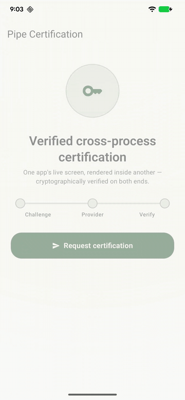
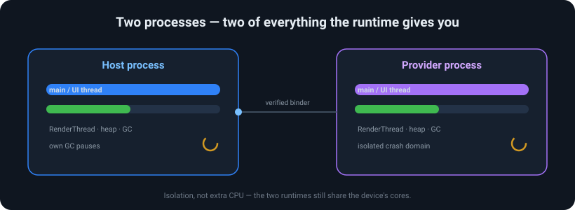
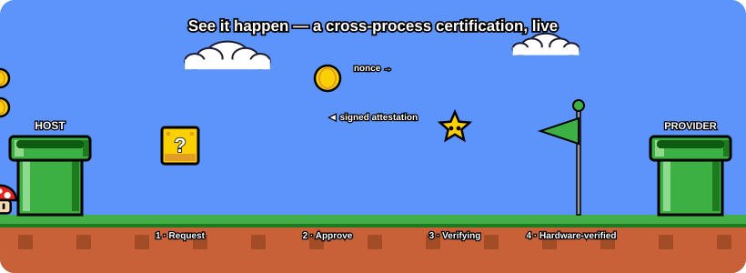
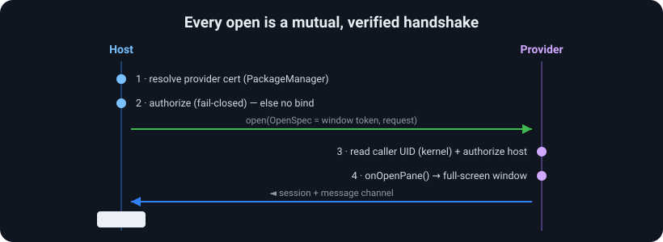

#  uI-PiPe

<p align="center">
  <a href="https://jitpack.io/#iamjosephmj/uI-PiPe"></a>
  <a href="https://github.com/iamjosephmj/uI-PiPe/actions/workflows/ci.yml"></a>
  <a href="LICENSE"></a>
  
  
</p>

**One app's live screen, rendered inside another app — across the process boundary, and verified.**

App&nbsp;A (the *host*) hands its window to App&nbsp;B (the *provider*), and App&nbsp;B draws its own real, full-screen UI **right inside App&nbsp;A's window**, from a separate process. On screen it's seamless — nothing tells the user a second app is drawing it. Yet the two apps never share code or memory, and App&nbsp;A only ever lets an App&nbsp;B it has **cryptographically verified** take over its window.

<p align="center"></p>
<p align="center"><em>Running on a Pixel 6 Pro: host → the provider's consent sheet <b>inside</b> the host → Approve → hardware-verified back in the host.</em></p>

> **Two processes. Two of everything the runtime gives you** — two UI threads, two render threads, two heaps and two GCs. A whole second runtime working for you, isolated from yours. *(Isolation, not extra CPU — both runtimes still share the device's cores.)*

<p align="center"></p>

Under the hood, App&nbsp;A's activity hands its **window token** to App&nbsp;B, which adds its `View` as a **real full-screen window** inside App&nbsp;A's own window hierarchy — plus a two-way typed channel between them. App&nbsp;A's jank never stalls it, an App&nbsp;B crash can't take down App&nbsp;A, and neither app's code runs in the other. And because it's a genuine window — not a screenshot, a WebView, or a `RemoteViews` — it's a first-class focus / **soft-keyboard (IME)** / input target on every supported API, with no `SurfaceControlViewHost` and no `@hide` APIs.

**Status:** first release (`1.0.0-alpha01`). Android 11+ (`minSdk 30`). Targets a closed app family / vetted partners, not an open marketplace. Deep dive: **[ARCHITECTURE.md](ARCHITECTURE.md)**.

## See it in action

The sample apps run a real cross-process certification: the host requests certification, the provider renders a consent pane *in its own process*, signs a challenge nonce with an AndroidKeyStore key, and the host verifies the attestation chain — the pane is the provider's own full-screen window over the host.

<p align="center"></p>

## How it works

Every open is a mutual, cryptographically-gated handshake — identity is kernel/PackageManager-derived on both ends, never self-reported, and a denial produces no bind and no window.

<p align="center"></p>

## Use cases

- **Third-party / SDK UI you don't want in your process** — a vendor ships a screen you render in *their* process; their crash, jank, or memory can't touch your app, and their code never runs in yours.
- **Super-app mini-apps & plugins** — host a partner's screen inside your app, locked to their exact signing key.
- **Verified partner flows** — payment, identity, consent, or attestation UIs where the host must *prove who is drawing* before it hands over the screen.
- **On-device consent with hardware attestation** — exactly the sample: the provider signs a challenge with an AndroidKeyStore key, the host verifies the chain.

**Not for** an open marketplace of arbitrary providers — the trust anchor is signing identity (same key or an allowlist), aimed at a closed app family / vetted partners.

## Install

Available via [JitPack](https://jitpack.io/#iamjosephmj/uI-PiPe). Add the repository:

```kotlin
// settings.gradle.kts
dependencyResolutionManagement {
    repositories {
        mavenCentral()
        maven("https://jitpack.io")
    }
}
```

Then the dependency:

```kotlin
implementation("com.github.iamjosephmj.uI-PiPe:pipe:1.0.0-alpha01")
implementation("com.github.iamjosephmj.uI-PiPe:pipe-serialization:1.0.0-alpha01") // optional: typed messages
```

## Host

Nothing to place in your layout — the provider draws its own window. Launch a pane from a `ComponentActivity`:

```kotlin
PipeFullScreen.open(
    activity = this,
    provider = ProviderComponent("com.example.provider", "com.example.provider.PaneService"),
    request = PipeRequest("demo.editor"),
    authorizer = PipeAuthorizers.sameSigningKey(this), // default
    onSession = { session ->
        lifecycleScope.launch { session.messages.collect { /* provider → host */ } }
        lifecycleScope.launch { session.send(PipeMessage(bundleOf("text" to "hello"))) } // host → provider
    },
    onError = { e -> /* PipeDeniedException (refused) | timeout | transport | died */ },
)
```

`open()` binds and verifies the provider, then delivers a live `PipeSession` to `onSession` (or a `PipeException` to `onError`). The pane tears down on `session.close()`, back-press, or activity destroy — whichever comes first. Declare providers you bind in `<queries>`.

## Provider

```kotlin
class PaneService : PipeProviderService() {
    override suspend fun onOpenPane(request: PipeRequest, host: HostHandle): PaneResult {
        val label = TextView(this).apply { text = "pane-ready" }
        return PaneResult.Content(object : PipeContent {
            override val view = label
            override fun onMessage(m: PipeMessage) { label.text = m.payload.getString("text") }
        })
    }
}
```

Runs on the provider's main thread, only after the host clears the provider's gate. The pane is a window the library adds over the host — **full-screen and transparent by default** — so a dialog, a bottom sheet, or a scrim is just something *you draw and animate inside it* (a centered card over your own scrim, etc.). The library only gives you the canvas:

```kotlin
PaneResult.Content(content)                                // default: full-screen transparent
PaneResult.Content(content, PaneSpec(translucent = false)) // opaque full-screen instead
```

Because the pane's root is a lifecycle/saved-state/viewmodel owner, you can drop a `ComposeView` straight in and animate the entrance with Compose — the sample provider renders its consent flow as a Compose dialog. BACK dismisses the pane, and `host.close()` lets the provider dismiss it too. Override `authorizer()` to change who may open it. Manifest: an exported `<service>` with the `tech.ssemaj.pipe.action.OPEN_PANE` action.

## Trust & authorization

A `PipeAuthorizer` only ever sees the verified `PeerIdentity` the library built — never a self-reported name.

```kotlin
fun interface PipeAuthorizer { suspend fun authorize(peer: PeerIdentity, request: PipeRequest): AuthDecision }

PipeAuthorizers.sameSigningKey(context)          // only your own signing key (default)
PipeAuthorizers.allowlist("aa11…", "bb22…")      // specific partner signing certs (SHA-256)
anyOf(sameSigningKey(context), allowlist(cert))  // compose
```

`authorize` is `suspend`, so a policy may call a backend or prompt for consent. Get a partner's cert hash with `apksigner verify --print-certs app.apk`. A host only ever hands its window token to a provider it has cryptographically verified — that gate is what keeps a full-screen provider window safe. Full model (UID-gated callbacks, shared-UID semantics, `BIND_PANE`): [ARCHITECTURE.md §7 & §12](ARCHITECTURE.md).

## Typed messaging

`:pipe-serialization` carries `@Serializable` messages (CBOR) over the same channel:

```kotlin
session.send<DemoMessage>(Ping("hi"))            // send the sealed supertype
session.messagesOf<DemoMessage>().collect { … }  // Flow<DemoMessage>
```

## Channel semantics

Independent per-direction streams. Delivery is **ordered** and **de-duplicated**, and **gap-tolerant** — at-most-once and in order, *not* gap-free.

## Testing

```bash
./gradlew :pipe:testDebugUnitTest                                  # unit
# on-device: install the sample + evil apps, then:
./gradlew :sample-host:connectedDebugAndroidTest :evil-host:connectedDebugAndroidTest
```

`sample-host` covers render, input into the pane (including IME), both-direction channels, the full attestation round-trip, and teardown. The `evil-*` apps (signed with a different key) assert both directions of denial. The full suite is verified green end-to-end on **API 30 (emulator)** and a **physical Pixel 6 Pro (API 36)** — the two ends of the supported range.

## Known limitations

- **`minSdk 30`** (Android 11) — the floor for the cross-process sub-window and the auth stack. **Public APIs only, no `@hide`/reflection** (Play-safe). Full interaction and native IME work across the whole range; verified end-to-end on API 30 and API 36.
- **Provider owns the window over the host** — full-screen and transparent by default, so a pane can be see-through (dialogs/sheets show host content behind them) while still consuming input over its bounds. That's a larger surface than an embedded pane; dismissing the *visible* window is provider-cooperative (BACK/lifecycle/`session.close()` all tear it down; the host fully controls the binding either way). The identity gate is what makes handing over the window token safe — see [Trust & authorization](#trust--authorization).
- **One pane, full-screen** — Pipe does exactly one thing: a single full-screen pane. No embedded/resizable/multi-pane surfaces (an earlier `SurfaceControlViewHost` build did; it was cut so IME and input work identically on every API, with no `@hide`).
- **Coarse-grained** — every message is a binder transaction; great for a pane + occasional messages, not high-frequency loops.
- **Alpha** — coherent and adversarially tested, not yet a hardened release.

## Contributing

Contributions are welcome — see **[CONTRIBUTING.md](CONTRIBUTING.md)** for how to build, test (unit + connected + `apiCheck`), and submit changes. Security issues in the trust model should be reported privately, not as public issues. Licensed under [Apache-2.0](LICENSE).
