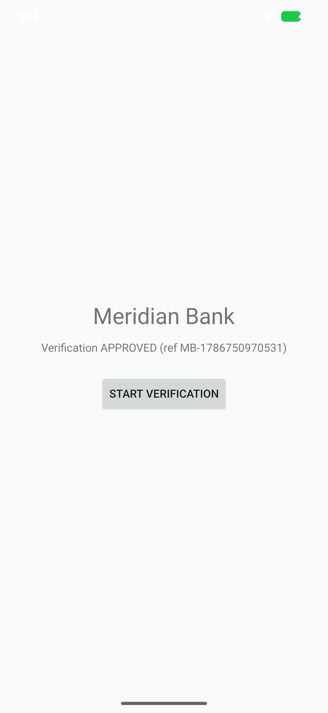
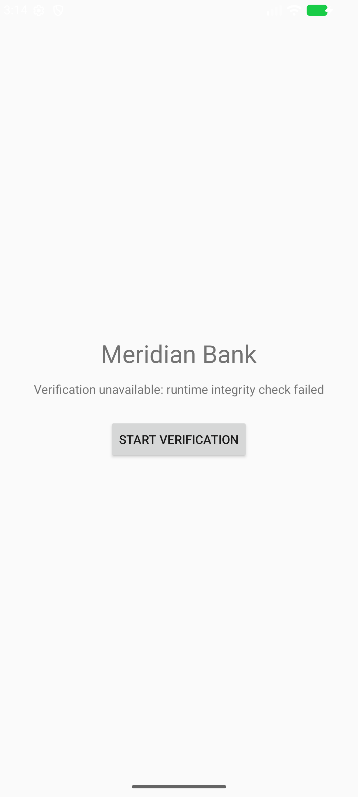

author: Joseph MJ
summary: Embed a RASP-guarded KYC verifier in a bank app with uI-PiPe
id: uipipe-kyc-codelab
categories: android,security
environments: Web
status: Published
feedback link: https://github.com/iamjosephmj/uI-PiPe/issues

# Embed a RASP-guarded KYC verifier with uI-PiPe

## Introduction
Duration: 3:00

**What you'll build:** *Meridian Bank* (the host app) embeds *VerifyID* — a separately-signed,
RASP-guarded KYC verifier — as a live, full-screen pane inside its own window. VerifyID runs in
its own process, under its own signing key, and the bank only ever hands it the window token
after cryptographically verifying its identity.

Two independent security layers are at work:

1. **uI-PiPe's identity gate** — the host only opens a pane for a provider whose signing-cert
   SHA-256 is on an explicit allowlist. No self-reported package name is ever trusted.
2. **hydra's runtime self-protection (RASP)** — the verifier's `guarded` build detects a
   compromised runtime (root, emulator, tampering) and terminates itself *before* any KYC UI or
   logic runs.

By the end of this codelab you will have:

- A shared, pure-Kotlin wire contract (`:sample-kyc-contract`) used by both apps.
- A KYC verifier app (`:sample-kyc-verifier`, "VerifyID") that renders a mock identity wizard
  inside the host's window and reports a typed result back.
- A bank host app (`:sample-kyc-host`, "Meridian Bank") that opens the verifier, pins its exact
  signing certificate, and gracefully survives the verifier's process being killed mid-flow.
- A hydra-guarded (`-Prasp`) build of the verifier that self-terminates on an untrusted runtime —
  and a host that degrades gracefully instead of crashing when that happens.

Here's the finished happy path — Meridian Bank showing the verifier's `APPROVED` result:



And here's the RASP finale — the guarded verifier killed itself before it could reply, and the
host recovered gracefully instead of crashing:



### Prerequisites

- A working uI-PiPe checkout (this codelab builds inside the `pipe` monorepo — `:pipe` and
  `:pipe-serialization` are existing modules you depend on, not something you copy in).
- Android Studio / a JDK 17 toolchain, `compileSdk`/`targetSdk` 36, `minSdk` 30.
- An emulator or device running API 30+ for the on-device steps.

### What you'll need to know

Basic Kotlin, Android `Service`/`Activity` fundamentals, and Gradle Kotlin DSL. No prior uI-PiPe
experience is assumed — each step explains the relevant API as it's introduced.

Positive
: uI-PiPe's trust model is: verify who is asking (kernel/PackageManager-derived signing identity,
never self-reported), *then* hand over the window. Everything else in this codelab builds on
that one idea.

## Project setup
Duration: 4:00

This codelab adds three new Gradle modules to the existing `pipe` monorepo: a shared contract
module, the verifier app, and the host app. All three depend on the repo's existing `:pipe` and
`:pipe-serialization` modules — you are not vendoring or copying uI-PiPe itself.

### Register the modules

In the root `settings.gradle.kts`, the three new modules sit alongside the existing sample
modules:

```kotlin
pluginManagement {
    repositories { google(); mavenCentral(); gradlePluginPortal() }
}
dependencyResolutionManagement {
    repositoriesMode.set(RepositoriesMode.PREFER_SETTINGS)
    repositories {
        google()
        mavenCentral()
    }
}
rootProject.name = "pipe"
include(":pipe")
include(":pipe-serialization")
include(":sample-contract")
include(":sample-kyc-contract")
include(":sample-kyc-verifier")
include(":sample-kyc-host")
include(":sample-provider")
include(":sample-host")
include(":sample-solo")
include(":evil-provider")
include(":evil-host")
```

(The `dependencyResolutionManagement.repositories` block above will grow a third, hydra-specific
repo entry in the **Add RASP with hydra** step later — leave it as shown for now.)

### Opt the app modules out of API tracking

The root `build.gradle.kts` runs
[binary-compatibility-validator](https://github.com/Kotlin/binary-compatibility-validator)
(`bcv`) across the repo to catch accidental public-API breaks in the *library* modules. App
modules (the samples, and now the KYC trio) don't ship a public API, so they're excluded:

```kotlin
plugins {
    alias(libs.plugins.android.library) apply false
    alias(libs.plugins.android.application) apply false
    alias(libs.plugins.kotlin.android) apply false
    alias(libs.plugins.kotlin.parcelize) apply false
    alias(libs.plugins.kotlin.jvm) apply false
    alias(libs.plugins.binary.compatibility.validator)
}

apiValidation {
    ignoredProjects.addAll(listOf("sample-host", "sample-provider", "evil-host", "evil-provider", "sample-contract", "sample-kyc-contract", "sample-kyc-verifier", "sample-kyc-host"))
}
```

Negative
: `bcv` 0.16.3 rejects `ignoredProjects` entries for modules that don't exist yet. If you're
following along by creating modules one at a time, only add each module's name once its
`build.gradle.kts` exists — otherwise the Gradle sync fails.

### Verify it

```bash
./gradlew projects
```

Expected: the project list includes `:sample-kyc-contract`, `:sample-kyc-verifier`, and
`:sample-kyc-host` (their build files don't exist yet — that's the next three steps — so a full
build will not succeed until then).

## The shared contract
Duration: 3:00

`:sample-kyc-contract` is a **pure-JVM Kotlin module** — no Android dependency at all — holding
the wire types both apps agree on. Keeping it Android-free means it compiles fast and its round
trips can be unit-tested on the JVM without an emulator.

### Module build file

`sample-kyc-contract/build.gradle.kts`:

```kotlin
plugins {
    alias(libs.plugins.kotlin.jvm)
    alias(libs.plugins.kotlin.serialization)
}

java { toolchain { languageVersion.set(JavaLanguageVersion.of(17)) } }

dependencies {
    api(libs.kotlinx.serialization.cbor)
    testImplementation(libs.junit)
}
```

It depends on `kotlinx-serialization-cbor` because `:pipe-serialization` (used by both apps to
send typed messages) carries `@Serializable` payloads over the wire as CBOR.

### The contract types

`sample-kyc-contract/src/main/kotlin/tech/ssemaj/pipe/samples/kyc/KycContract.kt`:

```kotlin
package tech.ssemaj.pipe.samples.kyc

import kotlinx.serialization.Serializable

/** Shared wire contract for the KYC codelab. Pure-JVM so both the host and verifier apps can depend on it. */
object KycContract {
    /** Request action the bank host opens the verifier with. */
    const val ACTION_KYC = "pipe.demo.kyc"
}

/** Depth of the identity check the bank is asking for (mock). */
@Serializable
enum class KycLevel { BASIC, ENHANCED }

/** Outcome the verifier reports back to the bank (mock). */
@Serializable
enum class KycStatus { APPROVED, DECLINED, ERROR }

/** Bank → verifier: start a verification for an opaque [reference] at the requested [level]. */
@Serializable
data class KycRequest(val reference: String, val level: KycLevel)

/** Verifier → bank: the result for [reference]. [issuedAtEpochMs] is a wall-clock stamp set by the verifier. */
@Serializable
data class KycResult(val reference: String, val status: KycStatus, val issuedAtEpochMs: Long)
```

Four types, deliberately small:

- `KycContract.ACTION_KYC` — the intent action the pane request is opened with. It plays the
  same role as an intent action does for `startActivity` — it says *what* is being requested,
  not *who* is being asked.
- `KycRequest` — sent host → verifier once the pane is open, carrying the bank's own opaque
  correlation id (`reference`) and the requested depth (`level`).
- `KycResult` — sent verifier → host with the outcome and a timestamp.
- `KycLevel` / `KycStatus` — small closed enums so both sides exhaustively handle every case.

### Verify it

```bash
./gradlew :sample-kyc-contract:test
```

Expected: `BUILD SUCCESSFUL`. A round-trip test (`KycContractRoundTripTest`) CBOR-encodes and
decodes both `KycRequest` and `KycResult` and asserts equality — cheap insurance that the
`@Serializable` types stay wire-compatible as you evolve them.

## Build the KYC verifier
Duration: 6:00

`:sample-kyc-verifier` is VerifyID — an installable app whose only job is to expose one
`PipeProviderService` that renders a mock identity wizard and reports back a typed `KycResult`.

### Generate VerifyID's own signing key

VerifyID is deliberately signed with a **different key** than the bank host — that's the whole
point of the trust boundary you'll pin two steps from now. Generate it once, from the repo root:

```bash
keytool -genkeypair -v -keystore security/kyc-verifier.keystore \
  -alias verifier -keyalg RSA -keysize 2048 -validity 10000 \
  -storepass verifierpass -keypass verifierpass \
  -dname "CN=VerifyID, O=VerifyID Inc, C=US"
```

Expected: `security/kyc-verifier.keystore` is created.

### Module build file

`sample-kyc-verifier/build.gradle.kts`:

```kotlin
plugins {
    alias(libs.plugins.android.application)
    alias(libs.plugins.kotlin.android)
}

// RASP is opt-in: `-Prasp` applies the hydra plugin (lethal, physical-device only). A plain build
// stays emulator-runnable. Gradle plugins are module-global, so this gates the whole module build.
val raspEnabled = providers.gradleProperty("rasp").isPresent
if (raspEnabled) apply(plugin = libs.plugins.hydra.get().pluginId)

android {
    namespace = "tech.ssemaj.pipe.kycverifier"
    compileSdk = 36
    defaultConfig {
        applicationId = if (raspEnabled) "tech.ssemaj.pipe.kycverifier.guarded" else "tech.ssemaj.pipe.kycverifier"
        minSdk = 30
        targetSdk = 36
        versionCode = 1
        versionName = "1.0"
    }
    signingConfigs {
        create("verifier") {
            storeFile = rootProject.file("security/kyc-verifier.keystore")
            storePassword = "verifierpass"
            keyAlias = "verifier"
            keyPassword = "verifierpass"
        }
    }
    buildTypes {
        getByName("debug") { signingConfig = signingConfigs.getByName("verifier") }
    }
    compileOptions { sourceCompatibility = JavaVersion.VERSION_17; targetCompatibility = JavaVersion.VERSION_17 }
    kotlinOptions { jvmTarget = "17" }
}
dependencies {
    implementation(project(":pipe"))
    implementation(project(":pipe-serialization"))
    implementation(project(":sample-kyc-contract"))
    implementation(libs.appcompat)
    implementation(libs.coroutines.android)
}
```

Ignore the `raspEnabled` / hydra lines for now — they're explained in full in the **Add RASP
with hydra** step. For this step, treat the module as if that `if` block never fires: a plain
`applicationId = "tech.ssemaj.pipe.kycverifier"`, signed with `security/kyc-verifier.keystore`.

### The manifest

`sample-kyc-verifier/src/main/AndroidManifest.xml`:

```xml
<manifest xmlns:android="http://schemas.android.com/apk/res/android">
    <application android:label="VerifyID">
        <service
            android:name=".KycVerifierService"
            android:exported="true">
            <intent-filter>
                <action android:name="tech.ssemaj.pipe.action.OPEN_PANE" />
            </intent-filter>
        </service>
    </application>
</manifest>
```

`android:exported="true"` plus the `tech.ssemaj.pipe.action.OPEN_PANE` intent filter is what
makes a service bindable as a uI-PiPe provider at all — the library looks for exactly this
action when the host resolves the component.

### The pane UI

`sample-kyc-verifier/src/main/java/tech/ssemaj/pipe/kycverifier/KycPaneView.kt` — a small
`ViewFlipper` wizard (Consent → mock ID capture → mock selfie → Verified), driven programmatically:

```kotlin
package tech.ssemaj.pipe.kycverifier

import android.content.Context
import android.graphics.Color
import android.view.Gravity
import android.view.View
import android.widget.Button
import android.widget.LinearLayout
import android.widget.TextView
import android.widget.ViewFlipper
import tech.ssemaj.pipe.core.CloseReason
import tech.ssemaj.pipe.core.PipeMessage
import tech.ssemaj.pipe.provider.PipeContent
import tech.ssemaj.pipe.samples.kyc.KycStatus

/**
 * The verifier's UI, rendered inside the host's window as a uI-PiPe pane. A small mock wizard —
 * no real camera or PII. [onDecision] is invoked once with the user's outcome; [onClose] dismisses.
 */
class KycPaneView(
    ctx: Context,
    private val bankName: String,
    private val onDecision: (KycStatus) -> Unit,
    private val onClose: () -> Unit,
) : PipeContent {

    private val flipper = ViewFlipper(ctx)

    override val view: View get() = flipper

    init {
        flipper.setBackgroundColor(Color.parseColor("#0D141D"))
        flipper.addView(screen(ctx, "Verify your identity",
            "VerifyID needs to confirm your identity for $bankName.", "Continue") { flipper.showNext() })
        flipper.addView(screen(ctx, "Scan your ID",
            "[ mock document frame ]\nNo real camera — this is a demo.", "Capture") { flipper.showNext() })
        flipper.addView(screen(ctx, "Liveness selfie",
            "[ mock selfie frame ]\nNo real camera — this is a demo.", "Capture") { flipper.showNext() })
        flipper.addView(screen(ctx, "Verified ✓",
            "Identity confirmed for $bankName.", "Done") { onDecision(KycStatus.APPROVED) })
    }

    private fun screen(ctx: Context, title: String, body: String, cta: String, onCta: () -> Unit): View =
        LinearLayout(ctx).apply {
            orientation = LinearLayout.VERTICAL
            gravity = Gravity.CENTER
            setPadding(72, 72, 72, 72)
            addView(TextView(ctx).apply { text = title; textSize = 24f; setTextColor(Color.WHITE) })
            addView(TextView(ctx).apply {
                text = "\n$body\n"; textSize = 15f; gravity = Gravity.CENTER
                setTextColor(Color.parseColor("#8B98A5"))
            })
            addView(Button(ctx).apply { text = cta; setOnClickListener { onCta() } })
            addView(Button(ctx).apply {
                text = "Cancel"; setOnClickListener { onDecision(KycStatus.DECLINED) }
            })
        }

    override fun onMessage(message: PipeMessage) { /* request handled in the service before mount */ }
    override fun onClosed(reason: CloseReason) { onClose() }
}
```

`PipeContent` is uI-PiPe's contract for "the view you want rendered inside the host's window."
`onMessage` receives further messages from the host after the pane is open; `onClosed` fires when
the pane tears down for any reason.

### The provider service

`sample-kyc-verifier/src/main/java/tech/ssemaj/pipe/kycverifier/KycVerifierService.kt`:

```kotlin
package tech.ssemaj.pipe.kycverifier

import kotlinx.coroutines.launch
import tech.ssemaj.pipe.auth.AuthDecision
import tech.ssemaj.pipe.auth.PipeAuthorizer
import tech.ssemaj.pipe.core.PipeRequest
import tech.ssemaj.pipe.provider.HostHandle
import tech.ssemaj.pipe.provider.PaneResult
import tech.ssemaj.pipe.provider.PipeProviderService
import tech.ssemaj.pipe.samples.kyc.KycResult
import tech.ssemaj.pipe.samples.kyc.KycStatus
import tech.ssemaj.pipe.serialization.send

/**
 * VerifyID's KYC provider. Renders a mock verification wizard in the bank's window and returns a
 * typed [KycResult]. In the `guarded` build (Task 5) hydra RASP self-terminates this process on a
 * compromised runtime, before any of this runs.
 */
class KycVerifierService : PipeProviderService() {

    // Host→verifier pinning is the codelab's lesson: the BANK pins US. We accept the bank as-is.
    // In production you would pin the bank's cert here too (symmetric); see the codelab callout.
    override fun authorizer(): PipeAuthorizer = PipeAuthorizer { _, _ -> AuthDecision.Allow }

    override suspend fun onOpenPane(request: PipeRequest, host: HostHandle): PaneResult {
        // The bank's opaque correlation id, echoed back in the result.
        val reference = request.extras.getString("reference") ?: "unknown"
        val bankName = request.extras.getString("bankName") ?: "the bank"

        val content = KycPaneView(
            ctx = this,
            bankName = bankName,
            onDecision = { status ->
                paneScope.launch {
                    host.send(KycResult(reference, status, System.currentTimeMillis()))
                    host.close()
                }
            },
            onClose = {},
        )
        return PaneResult.Content(content)
    }
}
```

Two things worth calling out explicitly:

Positive
: **`authorizer()` is overridden, and it matters why.** Every `PipeProviderService` has a default
`authorizer()` — `PipeAuthorizers.sameSigningKey(context)` — that only admits callers signed
with *the provider's own key*. VerifyID and Meridian Bank are signed with two different keys by
design (that's the trust boundary this whole codelab teaches), so the default would reject the
bank outright. VerifyID overrides `authorizer()` to `AuthDecision.Allow` unconditionally — it
trusts *any* caller for `onOpenPane`, and instead relies entirely on the **host** pinning
*VerifyID's* cert (next step) to keep the channel safe. This is a one-directional trust decision,
made deliberately, not an oversight — see the callout in **Pin the trust boundary**.

- `host.send(KycResult(...))` and `host.close()` use `:pipe-serialization`'s typed `send<T>`
  extension — the same CBOR-over-binder channel described in the main README's "Typed messaging"
  section — to hand the result back and then tear the pane down from the provider side.

### Verify it

```bash
./gradlew :sample-kyc-verifier:assembleDebug
```

Expected: `BUILD SUCCESSFUL`; an APK at
`sample-kyc-verifier/build/outputs/apk/debug/sample-kyc-verifier-debug.apk`, signed with
`security/kyc-verifier.keystore`.

## Build the bank host
Duration: 5:00

`:sample-kyc-host` is Meridian Bank — a one-screen app that opens VerifyID as a full-screen pane,
sends it a `KycRequest`, and reacts to the typed `KycResult` (or to failure).

### Module build file

`sample-kyc-host/build.gradle.kts` — note there is **no `signingConfigs` block**, so it's signed
with Android's default debug key, deliberately different from VerifyID's:

```kotlin
plugins {
    alias(libs.plugins.android.application)
    alias(libs.plugins.kotlin.android)
}
android {
    namespace = "tech.ssemaj.pipe.kychost"
    compileSdk = 36
    defaultConfig {
        applicationId = "tech.ssemaj.pipe.kychost"
        minSdk = 30
        targetSdk = 36
        versionCode = 1
        versionName = "1.0"
    }
    compileOptions { sourceCompatibility = JavaVersion.VERSION_17; targetCompatibility = JavaVersion.VERSION_17 }
    kotlinOptions { jvmTarget = "17" }
}
dependencies {
    implementation(project(":pipe"))
    implementation(project(":pipe-serialization"))
    implementation(project(":sample-kyc-contract"))
    implementation(libs.appcompat)
    implementation(libs.coroutines.android)
    implementation(libs.androidx.lifecycle.runtime)
}
```

### The manifest — package visibility

`sample-kyc-host/src/main/AndroidManifest.xml`:

```xml
<manifest xmlns:android="http://schemas.android.com/apk/res/android">
    <queries>
        <package android:name="tech.ssemaj.pipe.kycverifier" />
    </queries>
    <application android:label="Meridian Bank" android:theme="@style/Theme.AppCompat.Light.NoActionBar">
        <activity android:name=".MainActivity" android:exported="true">
            <intent-filter>
                <action android:name="android.intent.action.MAIN" />
                <category android:name="android.intent.category.LAUNCHER" />
            </intent-filter>
        </activity>
    </application>
</manifest>
```

The `<queries>` block is required on modern Android package-visibility rules — without it the
host can't resolve or bind VerifyID's service at all, regardless of what uI-PiPe's own identity
gate would decide.

### The layout

`sample-kyc-host/src/main/res/layout/activity_main.xml` — a title, a status line, and one button:

```xml
<?xml version="1.0" encoding="utf-8"?>
<LinearLayout xmlns:android="http://schemas.android.com/apk/res/android"
    android:layout_width="match_parent" android:layout_height="match_parent"
    android:orientation="vertical" android:gravity="center" android:padding="24dp">

    <TextView android:id="@+id/title" android:layout_width="wrap_content" android:layout_height="wrap_content"
        android:text="Meridian Bank" android:textSize="28sp" />
    <TextView android:id="@+id/status" android:layout_width="wrap_content" android:layout_height="wrap_content"
        android:layout_marginTop="12dp" android:text="Account setup: identity check required" />
    <Button android:id="@+id/verify" android:layout_width="wrap_content" android:layout_height="wrap_content"
        android:layout_marginTop="24dp" android:text="Start verification" />
</LinearLayout>
```

### The Activity

`sample-kyc-host/src/main/java/tech/ssemaj/pipe/kychost/MainActivity.kt` — this is the finished,
final version (the `VERIFIER_CERT_SHA256` placeholder and the `firstOrNull` result-await are
both explained in the next two steps; you're looking at the destination, not an intermediate
draft):

```kotlin
package tech.ssemaj.pipe.kychost

import android.os.Bundle
import android.widget.Button
import android.widget.TextView
import androidx.appcompat.app.AppCompatActivity
import androidx.lifecycle.lifecycleScope
import kotlinx.coroutines.flow.first
import kotlinx.coroutines.flow.firstOrNull
import kotlinx.coroutines.launch
import tech.ssemaj.pipe.auth.PipeAuthorizers
import tech.ssemaj.pipe.core.PipeDeniedException
import tech.ssemaj.pipe.core.PipeRequest
import tech.ssemaj.pipe.core.PipeState
import tech.ssemaj.pipe.host.PipeFullScreen
import tech.ssemaj.pipe.host.ProviderComponent
import tech.ssemaj.pipe.samples.kyc.KycContract
import tech.ssemaj.pipe.samples.kyc.KycRequest
import tech.ssemaj.pipe.samples.kyc.KycLevel
import tech.ssemaj.pipe.samples.kyc.KycResult
import tech.ssemaj.pipe.serialization.messagesOf
import tech.ssemaj.pipe.serialization.send

class MainActivity : AppCompatActivity() {

    private companion object {
        const val VERIFIER_PKG = "tech.ssemaj.pipe.kycverifier"
        const val VERIFIER_SVC = "tech.ssemaj.pipe.kycverifier.KycVerifierService"
        // Filled in Task 4 with VerifyID's real signing-cert SHA-256 (lowercase hex, no colons).
        const val VERIFIER_CERT_SHA256 = "21027f81c7dacf5c09246d1eb6e61a4ea797ef5a8e198e74721be8739cd3e706"
    }

    override fun onCreate(savedInstanceState: Bundle?) {
        super.onCreate(savedInstanceState)
        setContentView(R.layout.activity_main)
        val status = findViewById<TextView>(R.id.status)

        findViewById<Button>(R.id.verify).setOnClickListener {
            status.text = "Opening VerifyID…"
            val reference = "MB-" + System.currentTimeMillis()
            val extras = Bundle().apply {
                putString("reference", reference)
                putString("bankName", "Meridian Bank")
                putString("level", KycLevel.ENHANCED.name)
            }
            PipeFullScreen.open(
                activity = this,
                provider = ProviderComponent(VERIFIER_PKG, VERIFIER_SVC),
                request = PipeRequest(KycContract.ACTION_KYC, extras),
                authorizer = PipeAuthorizers.allowlist(VERIFIER_CERT_SHA256),
                onSession = { session ->
                    lifecycleScope.launch {
                        session.send(KycRequest(reference, KycLevel.ENHANCED))
                        val result = session.messagesOf<KycResult>().firstOrNull()
                        if (result != null) {
                            status.text = "Verification ${result.status} (ref ${result.reference})"
                        }
                        // else: session closed before a result (e.g. RASP killed the verifier);
                        // the state-close collector below shows the failure message.
                    }
                    // Graceful teardown: a non-null Closed cause (e.g. RASP killed the verifier) is
                    // an unexpected failure, not a normal close.
                    lifecycleScope.launch {
                        val closed = session.state.first { it is PipeState.Closed } as PipeState.Closed
                        if (closed.cause != null) {
                            status.text = "Verification unavailable: runtime integrity check failed"
                        }
                    }
                },
                onError = { e ->
                    status.text = when (e) {
                        is PipeDeniedException -> "Verifier rejected: ${e.reason}"
                        else -> "Verification unavailable (${e::class.simpleName})"
                    }
                },
            )
        }
    }
}
```

Three uI-PiPe concepts appear here for the first time:

- **`PipeFullScreen.open(...)`** — the host's single entry point. It binds `provider`, runs the
  `authorizer` against the provider's verified signing identity, and — only on success — hands
  the provider its window token and calls `onSession` with a live `PipeSession`. Any failure
  along the way (bind failure, timeout, or an `authorizer` denial) instead calls `onError` with a
  `PipeException` — **no bind and no window are ever created for a rejected caller.**
- **`PipeAuthorizers.allowlist(VERIFIER_CERT_SHA256)`** — the identity gate. Covered in full in
  the next step.
- **Graceful failure handling** — the two `lifecycleScope.launch` blocks inside `onSession`,
  covered in full in the **Typed results + run end-to-end** step below.

### Verify it

```bash
./gradlew :sample-kyc-host:assembleDebug
```

Expected: `BUILD SUCCESSFUL`. The app won't successfully open a pane yet — `VERIFIER_CERT_SHA256`
above is VerifyID's real digest already (this codelab shows you the finished file), but if you're
typing this out yourself with a fresh keystore, yours will differ until the next step.

## Pin the trust boundary
Duration: 4:00

This is the step that turns "an app can bind an arbitrary service" into "the bank only ever hands
its window to the *one specific* VerifyID binary it trusts."

### Extract VerifyID's signing-cert SHA-256

From the repo root, using the keystore generated in the previous step:

```bash
keytool -list -v -keystore security/kyc-verifier.keystore -alias verifier -storepass verifierpass \
  | grep -i "SHA256:" | head -1
```

`keytool` prints the fingerprint as uppercase hex with colons
(`AA:BB:CC:...`). uI-PiPe's `PipeAuthorizers.allowlist(...)` expects **lowercase hex, no
colons** — normalize it:

```bash
keytool -list -v -keystore security/kyc-verifier.keystore -alias verifier -storepass verifierpass \
  | grep -i "SHA256:" | head -1 | sed 's/.*SHA256: //; s/://g' | tr 'A-Z' 'a-z'
```

Expected: a 64-character lowercase hex string, e.g.
`21027f81c7dacf5c09246d1eb6e61a4ea797ef5a8e198e74721be8739cd3e706`.

### Wire it into the host

In `MainActivity.kt` (shown in full in the previous step), the constant is:

```kotlin
const val VERIFIER_CERT_SHA256 = "21027f81c7dacf5c09246d1eb6e61a4ea797ef5a8e198e74721be8739cd3e706"
```

and it feeds `PipeAuthorizers.allowlist(...)`:

```kotlin
authorizer = PipeAuthorizers.allowlist(VERIFIER_CERT_SHA256),
```

`allowlist` builds a `PipeAuthorizer` that only ever sees the **verified** `PeerIdentity` uI-PiPe
derived from the kernel/PackageManager — never anything the provider self-reports — and compares
its signing-cert digest set against the ones you passed in. If VerifyID's APK were ever re-signed
with a different key (a compromised build, a malicious lookalike app installed under the same
package name, anything), the digest would no longer match and `open()` would deny the bind
outright — before any window token is handed over.

Negative
: **This pinning is one-directional in this codelab, and that's a deliberate teaching choice, not
an oversight.** The *host* pins the *verifier* here. The reverse — the verifier pinning the
host's signing cert inside its own `authorizer()` override — is exactly symmetric: it would call
`PipeAuthorizers.allowlist(bankCertSha256)` instead of unconditionally returning
`AuthDecision.Allow`. A production integration would very likely do both directions. This
codelab teaches one direction end-to-end rather than doubling every step; see
`KycVerifierService.authorizer()` in the previous step for where the second pin would go.

### Prove the pin is load-bearing — negative test

Temporarily corrupt one hex character of `VERIFIER_CERT_SHA256`, reinstall just the host, and
retry:

```bash
./gradlew :sample-kyc-host:installDebug
adb -s emulator-5554 shell am start -n tech.ssemaj.pipe.kychost/.MainActivity
```

Tap **Start verification**.

Expected: the status line reads `Verifier rejected: peer signing certs not in allowlist` — a
`PipeDeniedException` caught by the `onError` branch, `HOST_POLICY` reason. No pane ever appears;
no window token was ever handed to the tampered-cert scenario you just simulated.

**Restore the correct digest and reinstall** before moving on:

```kotlin
const val VERIFIER_CERT_SHA256 = "21027f81c7dacf5c09246d1eb6e61a4ea797ef5a8e198e74721be8739cd3e706"
```
```bash
./gradlew :sample-kyc-host:installDebug
```

### Verify it

With the correct digest restored, tap **Start verification** again — the VerifyID pane should
open normally over Meridian Bank's window (confirmed fully in the next step).

## Typed results + run end-to-end (dev)
Duration: 5:00

Time to install both apps and run the whole flow: bank opens verifier, verifier renders its
wizard *inside* the bank's window, user completes it, verifier reports back, bank displays the
result.

### Install both apps

```bash
export JAVA_HOME=/home/joseph/.jdks/temurin-23.0.2
export PATH="$HOME/Android/Sdk/platform-tools:$PATH"
./gradlew :sample-kyc-verifier:installDebug :sample-kyc-host:installDebug
```

Expected: both installs report `Success`.

Positive
: Adjust `JAVA_HOME` to your own JDK 17+ toolchain path — the value above is this codelab's
reference environment, not a requirement.

### Run the happy path

```bash
adb -s emulator-5554 shell am start -n tech.ssemaj.pipe.kychost/.MainActivity
```

Tap **Start verification** in Meridian Bank. VerifyID's pane appears full-screen, drawn *inside*
Meridian Bank's own window (its process, the bank's window — that's the architecture). Step
through **Continue → Capture → Capture → Done**.

Expected: the bank's status line reads `Verification APPROVED (ref MB-…)`, matching the
screenshot from the introduction.

### Why `firstOrNull`, not `first`

Look again at the result-await coroutine inside `onSession`:

```kotlin
lifecycleScope.launch {
    session.send(KycRequest(reference, KycLevel.ENHANCED))
    val result = session.messagesOf<KycResult>().firstOrNull()
    if (result != null) {
        status.text = "Verification ${result.status} (ref ${result.reference})"
    }
    // else: session closed before a result (e.g. RASP killed the verifier);
    // the state-close collector below shows the failure message.
}
```

This looks like a defensive-programming nicety. It is load-bearing, and the **Add RASP with
hydra** step below shows exactly why: `Flow.first()` throws `NoSuchElementException` if the
underlying channel closes having emitted nothing — which is precisely what happens if the
verifier's process dies (killed by RASP, a crash, anything) *before* it calls `host.send(...)`.
An uncaught `NoSuchElementException` on this `lifecycleScope` coroutine takes down the entire
bank app, not just the pane. `firstOrNull()` instead completes quietly with `null`, and the
sibling coroutine watching `session.state` for `PipeState.Closed(cause)` is left to report the
graceful failure message. Both coroutines run independently — one succeeding never protects the
app from the other throwing, so each one has to be individually safe.

### Verify it

Re-run the happy path once more to confirm `APPROVED` still renders correctly with the
`firstOrNull` change in place — it should look identical to the first run; the change only
matters on the failure path exercised in the finale below.

## Add RASP with hydra
Duration: 9:00

So far the only protection is *identity* — the bank knows it's talking to the real VerifyID
binary. It says nothing about whether VerifyID's **runtime** is trustworthy — rooted, running
under a debugger, hooked by Frida, or executing inside an emulator pretending to be a real
device. That's what Runtime Application Self-Protection (RASP) is for. This step wires in
[hydra](https://github.com/ssemaj/hydra) as a zero-code, build-time hardening layer on
VerifyID's `guarded` build variant.

### Add hydra to the version catalog

`gradle/libs.versions.toml` — under `[versions]`:

```toml
hydra = "2.3.0"
```

under `[plugins]`:

```toml
hydra = { id = "tech.thessemaj.hydra", version.ref = "hydra" }
```

### Declare hydra at the root (apply false)

Root `build.gradle.kts` — hydra is declared but not applied at the root; only the verifier module
applies it, and only conditionally:

```kotlin
plugins {
    alias(libs.plugins.android.library) apply false
    alias(libs.plugins.android.application) apply false
    alias(libs.plugins.kotlin.android) apply false
    alias(libs.plugins.kotlin.parcelize) apply false
    alias(libs.plugins.kotlin.jvm) apply false
    alias(libs.plugins.binary.compatibility.validator)
    alias(libs.plugins.hydra) apply false
}
```

### Conditionally apply hydra in the verifier

At the top of `sample-kyc-verifier/build.gradle.kts`, right after the `plugins { }` block:

```kotlin
// RASP is opt-in: `-Prasp` applies the hydra plugin (lethal, physical-device only). A plain build
// stays emulator-runnable. Gradle plugins are module-global, so this gates the whole module build.
val raspEnabled = providers.gradleProperty("rasp").isPresent
if (raspEnabled) apply(plugin = libs.plugins.hydra.get().pluginId)
```

Gradle plugins apply at the whole-module level, not per build variant — so the codelab's spec
concept of "a `dev` flavor and a `guarded` flavor" is implemented here as a Gradle **property
toggle** (`-Prasp`) instead of a product-flavor split. Same intent — one hardened build, one
emulator-safe build — via the mechanism Gradle actually offers for conditionally applying a
plugin. The `applicationId` is switched alongside it so both builds can be installed on the same
device simultaneously:

```kotlin
    defaultConfig {
        applicationId = if (raspEnabled) "tech.ssemaj.pipe.kycverifier.guarded" else "tech.ssemaj.pipe.kycverifier"
        minSdk = 30
        targetSdk = 36
        versionCode = 1
        versionName = "1.0"
    }
```

### The hydra + `FAIL_ON_PROJECT_REPOS` trap — and the fix

Build `-Prasp` right now, before touching `settings.gradle.kts` again, and (if your settings file
still uses `FAIL_ON_PROJECT_REPOS`, Gradle's stricter default) you will hit this:

```
Build was configured to prefer settings repositories over project repositories but repository
'hydraRuntime' was added by build file 'sample-kyc-verifier/build.gradle.kts'
```

**Why this happens:** hydra 2.3.0's Gradle plugin, when applied, injects a **project-level**
Maven repository (it calls it `hydraRuntime`) to serve a vendored runtime AAR it needs at build
time. A `dependencyResolutionManagement` block configured with `FAIL_ON_PROJECT_REPOS` hard-fails
the build the instant *any* module declares its own repository outside the centralized settings
block — which is exactly what hydra's plugin does on your behalf, invisibly, the moment it's
applied.

**The fix**, already present in this repo's `settings.gradle.kts`, has two parts:

```kotlin
dependencyResolutionManagement {
    // PREFER_SETTINGS (not FAIL_ON_PROJECT_REPOS): hydra's build-time plugin (applied
    // conditionally in sample-kyc-verifier under -Prasp) injects a project-level Maven
    // repo ("hydraRuntime") to serve its vendored runtime AAR. FAIL_ON_PROJECT_REPOS
    // hard-errors on that project-level declaration; PREFER_SETTINGS instead ignores it
    // (warning only) and resolves exclusively from these settings-declared repos — so the
    // same "hydraRuntime" coordinate is re-declared below, pointed at the build-local m2
    // dir hydra populates, scoped to its group so it can't shadow other dependencies.
    repositoriesMode.set(RepositoriesMode.PREFER_SETTINGS)
    repositories {
        google()
        mavenCentral()
        maven(rootDir.resolve("build/hydra/m2")) {
            name = "hydraRuntime"
            content { includeGroup("io.ssemaj.rasp") }
        }
    }
}
```

1. **`repositoriesMode.set(RepositoriesMode.PREFER_SETTINGS)`** instead of the stricter
   `FAIL_ON_PROJECT_REPOS`. `PREFER_SETTINGS` downgrades a project-level repository declaration
   to a warning and resolves dependencies exclusively from the settings-declared repositories
   instead — so hydra's injected repo is silently ignored rather than fatal.
2. **Re-declaring hydra's runtime repo yourself, in settings**, pointed at the same
   build-local Maven directory (`build/hydra/m2`) hydra populates, and **group-scoped** via
   `content { includeGroup("io.ssemaj.rasp") }` so it can only ever resolve hydra's own
   coordinates — it can't accidentally shadow or intercept dependency resolution for anything
   else in the build.

Without both parts together, you either hard-fail (`FAIL_ON_PROJECT_REPOS` alone) or silently
lose the ability to resolve hydra's runtime AAR (`PREFER_SETTINGS` alone, without re-declaring
the repo in settings) — you need the mode switch *and* the settings-side repo declaration.

### Build both variants

```bash
./gradlew :sample-kyc-verifier:assembleDebug
```
Expected: `BUILD SUCCESSFUL`; no hydra tasks in the log; plain `tech.ssemaj.pipe.kycverifier` APK.

```bash
./gradlew :sample-kyc-verifier:assembleDebug -Prasp
```
Expected: `BUILD SUCCESSFUL`; hydra tasks appear in the log; APK `applicationId` is
`tech.ssemaj.pipe.kycverifier.guarded`.

### Verify it

```bash
./gradlew :sample-kyc-verifier:assembleDebug -Prasp
unzip -p sample-kyc-verifier/build/outputs/apk/debug/sample-kyc-verifier-debug.apk AndroidManifest.xml | grep -a kycverifier.guarded || true
```

The plain build and the guarded build should now coexist as two separately-installable APKs —
confirmed for real below, where the guarded build meets a hostile runtime.

### Trip it and recover

The payoff: install the **guarded** verifier on an emulator (which hydra treats as a
compromised runtime by design), watch it self-terminate, and confirm the bank survives instead of
crashing.

### Install the guarded verifier on the emulator

```bash
export PATH="$HOME/Android/Sdk/platform-tools:$PATH"
./gradlew :sample-kyc-verifier:assembleDebug -Prasp
adb -s emulator-5554 install -r sample-kyc-verifier/build/outputs/apk/debug/sample-kyc-verifier-debug.apk
```

### Point the host at the guarded build and watch

Temporarily set `VERIFIER_PKG = "tech.ssemaj.pipe.kycverifier.guarded"` in `MainActivity.kt`
(leave `VERIFIER_SVC` — the service class name is unchanged) and add the guarded package to the
host's manifest `<queries>` alongside the plain one. Reinstall the host, then launch and tap
**Start verification** while watching logcat:

```bash
adb -s emulator-5554 logcat -c
adb -s emulator-5554 shell am start -n tech.ssemaj.pipe.kychost/.MainActivity
adb -s emulator-5554 logcat | grep -iE "hydra|kyc|pipe" &
```

Expected in logcat: the guarded verifier process starts, hydra's native integrity check runs
inside `libdicore.so`, and the process dies by `SIGSEGV` within a few hundred milliseconds — for
example:

```
ActivityManager: Start proc 5770:tech.ssemaj.pipe.kycverifier.guarded/... for service {.../KycVerifierService}
dicore  : native_integrity: G3/G7 baseline captured libs=349 ...
libc    : Fatal signal 11 (SIGSEGV), code 1 (SEGV_MAPERR), fault addr 0x75c in tid 5770 (erifier.guarded)
```

This is hydra's emulator detection firing and deliberately terminating the process — *before*
`KycVerifierService.onOpenPane` ever runs, before any KYC UI renders, before any data (mock or
otherwise) is touched.

### Why the host must use `firstOrNull`, not `first`, here

This is the exact moment the earlier **Typed results** step's `firstOrNull()` choice pays off.
When the guarded verifier dies mid-flow, the pane had briefly opened (`onSession` already fired),
so uI-PiPe's binder-death callback takes the "live pane" teardown path: it sets
`PipeState.Closed(cause)` on `session.state` and closes the `messages` channel having sent
**zero** typed messages — the verifier was killed before it could call `host.send(KycResult(...))`.

With the buggy `session.messagesOf<KycResult>().first()` (this codelab's earlier, wrong
iteration — do not use it), `Flow.first()` on a channel that closes empty throws
`NoSuchElementException`. That exception is uncaught on its `lifecycleScope` coroutine, so it
propagates to the process's default uncaught-exception handler and **crashes the entire bank
app** — the system evicts it back to the launcher home screen, and the user never even sees a
status message, graceful or otherwise. Meanwhile the *sibling* coroutine watching for
`PipeState.Closed(cause)` may have already set a perfectly good status string — it doesn't
matter, because the other coroutine's crash tears down the whole process regardless.

With `firstOrNull()` (the version shown throughout this codelab), that same coroutine instead
completes quietly with `null` when the channel closes empty, and does nothing further. The
sibling `PipeState.Closed(cause)` collector is left to do its job uncontested:

```kotlin
lifecycleScope.launch {
    val closed = session.state.first { it is PipeState.Closed } as PipeState.Closed
    if (closed.cause != null) {
        status.text = "Verification unavailable: runtime integrity check failed"
    }
}
```

Expected status text on screen: `Verification unavailable: runtime integrity check failed` —
Meridian Bank's screen stays intact, the **Start verification** button is re-enabled, and the app
process never dies:


The lesson generalizes past this one codelab: whenever a typed-message `Flow` can legitimately
close having emitted nothing — a peer process dying is the common case, but a timeout or a
provider that simply never replies work the same way — prefer `firstOrNull()` (or a `try`/`catch`
around `first()`) over a bare `first()`. A `Flow` that closes empty is not a "should never
happen"; on a cross-process channel it's an ordinary, recoverable outcome.

### Clean up

Revert `VERIFIER_PKG` back to `"tech.ssemaj.pipe.kycverifier"` and remove the temporary guarded
`<queries>` entry from the host manifest before reinstalling for normal use — the guarded id was
only ever meant for this one on-device experiment.

```bash
./gradlew :sample-kyc-host:installDebug
```

### Verify it

Re-run the plain happy path from **Typed results + run end-to-end (dev)** once more: it should
show `Verification APPROVED (ref MB-…)` exactly as before, confirming the revert didn't leave
anything broken.

### Wrap-up

You built two apps that never share code or memory, wired a cryptographic identity gate between
them so the bank only ever hands its window to the real VerifyID, and layered a runtime
self-protection check on top so a compromised device can't even get that far. The two failure
modes you exercised — `PipeDeniedException` on a wrong signing cert, and graceful
`PipeState.Closed(cause)` recovery on a RASP-killed peer — are the two shapes of failure any
uI-PiPe integration should expect and handle explicitly, rather than letting either one become an
uncaught crash.

**Where to go next:**

- uI-PiPe main README — [Trust & authorization](https://github.com/iamjosephmj/uI-PiPe#trust--authorization),
  [Channel semantics](https://github.com/iamjosephmj/uI-PiPe#channel-semantics).
- [ARCHITECTURE.md](https://github.com/iamjosephmj/uI-PiPe/blob/main/ARCHITECTURE.md) — the full
  handshake, UID-gated callbacks, and `BIND_PANE` model.
- File issues or feedback: https://github.com/iamjosephmj/uI-PiPe/issues
